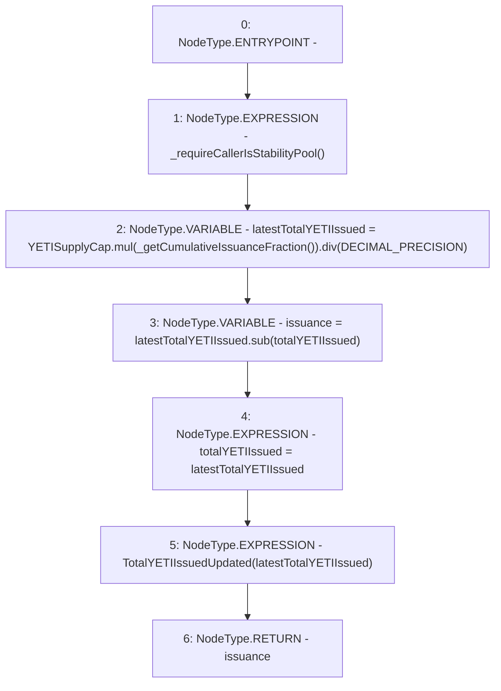

# Context: CommunityIssuance.issueYETI

**Contract:** `CommunityIssuance` (Inherits: BaseMath, CheckContract, Ownable, ICommunityIssuance)
**Signature:** `issueYETI() returns (uint256)`
**Method Selector ID:** `0xd6475d5b`
**Visibility:** `external`
**Environment-Free:** `No (reads EVM state context)`
**Modifiers:** None

### State Variables Interaction
- **Reads:** DECIMAL_PRECISION, YETISupplyCap, totalYETIIssued
- **Writes:** totalYETIIssued

### Environment & Verification Flags
- **Uses Foundry Cheatcodes:** No
- **Has Echidna Properties:** No

### Internal Calls Tree
- None

### External Calls / Value Transfers
- `SafeMath.TMP_141(uint256) = LIBRARY_CALL, dest:SafeMath, function:SafeMath.div(uint256,uint256), arguments:['TMP_140', 'DECIMAL_PRECISION'] `
- `SafeMath.TMP_142(uint256) = LIBRARY_CALL, dest:SafeMath, function:SafeMath.sub(uint256,uint256), arguments:['latestTotalYETIIssued', 'totalYETIIssued'] `
- `SafeMath.TMP_140(uint256) = LIBRARY_CALL, dest:SafeMath, function:SafeMath.mul(uint256,uint256), arguments:['YETISupplyCap', 'TMP_139'] `

### Control Flow Graph (CFG)


### Source Mapping
Declared in: `certora-ac-datasets/detasets/web3bugs/dataset/web3bugs/66/packages/contracts/contracts/YETI/CommunityIssuance.sol` on lines **93** to **103**

```solidity
    function issueYETI() external override returns (uint) {
        _requireCallerIsStabilityPool();

        uint latestTotalYETIIssued = YETISupplyCap.mul(_getCumulativeIssuanceFraction()).div(DECIMAL_PRECISION);
        uint issuance = latestTotalYETIIssued.sub(totalYETIIssued);

        totalYETIIssued = latestTotalYETIIssued;
        emit TotalYETIIssuedUpdated(latestTotalYETIIssued);
        
        return issuance;
    }

```
