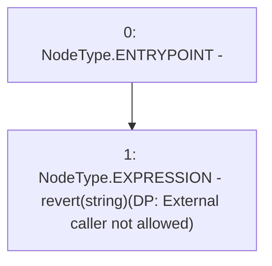

# Context: DefaultPoolTester._revertWrongFuncCaller

**Contract:** `DefaultPoolTester` (Inherits: DefaultPool, YetiCustomBase, BaseMath, IDefaultPool, IPool, ICollateralReceiver, CheckContract, Ownable)
**Signature:** `_revertWrongFuncCaller()`
**Method Selector ID:** `Internal (No Method ID)`
**Visibility:** `internal`
**Environment-Free:** `Yes`
**Modifiers:** None

### State Variables Interaction
- **Reads:** None
- **Writes:** None

### Assertion Checks & Business Requirements
- revert: `revert(string)(DP: External caller not allowed)`

### Environment & Verification Flags
- **Uses Foundry Cheatcodes:** No
- **Has Echidna Properties:** No

### Internal Calls Tree
- None

### External Calls / Value Transfers
- None

### Control Flow Graph (CFG)


### Source Mapping
Declared in: `certora-ac-datasets/detasets/web3bugs/dataset/web3bugs/66/packages/contracts/contracts/DefaultPool.sol` on lines **199** to **201**

```solidity
    function _revertWrongFuncCaller() internal view{
        revert("DP: External caller not allowed");
    }

```
