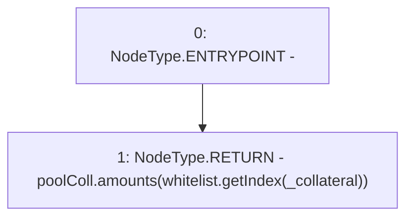

# Context: DefaultPoolTester.getCollateral

**Contract:** `DefaultPoolTester` (Inherits: DefaultPool, YetiCustomBase, BaseMath, IDefaultPool, IPool, ICollateralReceiver, CheckContract, Ownable)
**Signature:** `getCollateral(address) returns (uint256)`
**Method Selector ID:** `0x9b56d6c9`
**Visibility:** `public`
**Environment-Free:** `Yes`
**Modifiers:** None

### State Variables Interaction
- **Reads:** poolColl, whitelist
- **Writes:** None

### Environment & Verification Flags
- **Uses Foundry Cheatcodes:** No
- **Has Echidna Properties:** No

### Internal Calls Tree
- None

### External Calls / Value Transfers
- `IWhitelist.TMP_289(uint256) = HIGH_LEVEL_CALL, dest:whitelist(IWhitelist), function:getIndex, arguments:['_collateral']  `

### Control Flow Graph (CFG)


### Source Mapping
Declared in: `certora-ac-datasets/detasets/web3bugs/dataset/web3bugs/66/packages/contracts/contracts/DefaultPool.sol` on lines **78** to **80**

```solidity
    function getCollateral(address _collateral) public view override returns (uint256) {
        return poolColl.amounts[whitelist.getIndex(_collateral)];
    }

```
