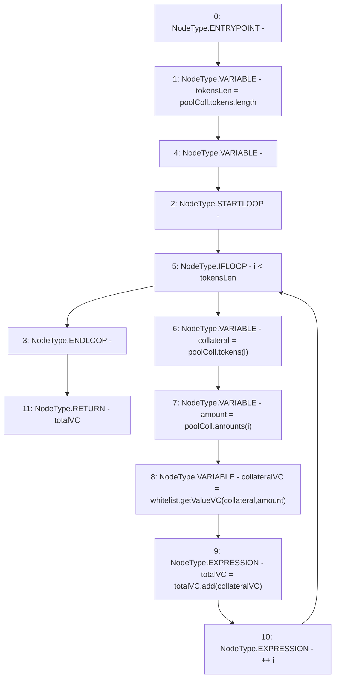

# Context: DefaultPoolTester.getVC

**Contract:** `DefaultPoolTester` (Inherits: DefaultPool, YetiCustomBase, BaseMath, IDefaultPool, IPool, ICollateralReceiver, CheckContract, Ownable)
**Signature:** `getVC() returns (uint256)`
**Method Selector ID:** `0x01d40b63`
**Visibility:** `external`
**Environment-Free:** `Yes`
**Modifiers:** None

### State Variables Interaction
- **Reads:** poolColl, whitelist
- **Writes:** None

### Environment & Verification Flags
- **Uses Foundry Cheatcodes:** No
- **Has Echidna Properties:** No

### Internal Calls Tree
- None

### External Calls / Value Transfers
- `SafeMath.TMP_294(uint256) = LIBRARY_CALL, dest:SafeMath, function:SafeMath.add(uint256,uint256), arguments:['totalVC', 'collateralVC'] `
- `IWhitelist.TMP_293(uint256) = HIGH_LEVEL_CALL, dest:whitelist(IWhitelist), function:getValueVC, arguments:['collateral', 'amount']  `

### Control Flow Graph (CFG)


### Source Mapping
Declared in: `certora-ac-datasets/detasets/web3bugs/dataset/web3bugs/66/packages/contracts/contracts/DefaultPool.sol` on lines **102** to **111**

```solidity
    function getVC() external view override returns (uint256 totalVC) {
        uint256 tokensLen = poolColl.tokens.length;
        for (uint256 i; i < tokensLen; ++i) {
            address collateral = poolColl.tokens[i];
            uint256 amount = poolColl.amounts[i];

            uint256 collateralVC = whitelist.getValueVC(collateral, amount);
            totalVC = totalVC.add(collateralVC);
        }
    }

```
