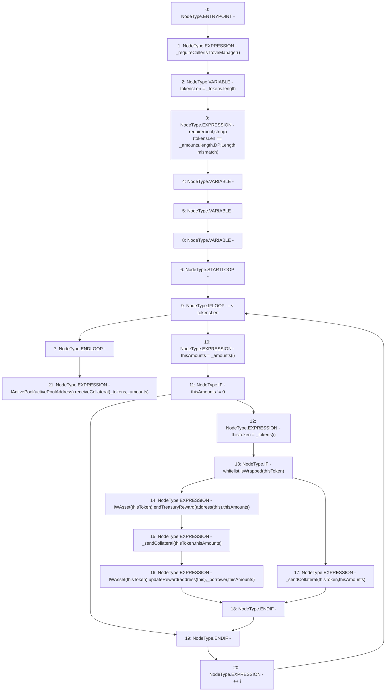

# Context: DefaultPoolTester.sendCollsToActivePool

**Contract:** `DefaultPoolTester` (Inherits: DefaultPool, YetiCustomBase, BaseMath, IDefaultPool, IPool, ICollateralReceiver, CheckContract, Ownable)
**Signature:** `sendCollsToActivePool(address[],uint256[],address)`
**Method Selector ID:** `0x61ccca58`
**Visibility:** `external`
**Environment-Free:** `No (reads EVM state context)`
**Modifiers:** None

### State Variables Interaction
- **Reads:** activePoolAddress, whitelist
- **Writes:** None

### Assertion Checks & Business Requirements
- require/assert: `require(bool,string)(tokensLen == _amounts.length,DP:Length mismatch)`

### Environment & Verification Flags
- **Uses Foundry Cheatcodes:** No
- **Has Echidna Properties:** No

### Internal Calls Tree
- None

### External Calls / Value Transfers
- `IActivePool.HIGH_LEVEL_CALL, dest:TMP_315(IActivePool), function:receiveCollateral, arguments:['_tokens', '_amounts']  `
- `IWAsset.HIGH_LEVEL_CALL, dest:TMP_311(IWAsset), function:updateReward, arguments:['TMP_312', '_borrower', 'thisAmounts']  `
- `IWAsset.HIGH_LEVEL_CALL, dest:TMP_307(IWAsset), function:endTreasuryReward, arguments:['TMP_308', 'thisAmounts']  `
- `IWhitelist.TMP_306(bool) = HIGH_LEVEL_CALL, dest:whitelist(IWhitelist), function:isWrapped, arguments:['thisToken']  `

### Control Flow Graph (CFG)


### Source Mapping
Declared in: `certora-ac-datasets/detasets/web3bugs/dataset/web3bugs/66/packages/contracts/contracts/DefaultPool.sol` on lines **131** to **163**

```solidity
    function sendCollsToActivePool(address[] memory _tokens, uint256[] memory _amounts, address _borrower)
        external
        override
    {
        _requireCallerIsTroveManager();
        uint256 tokensLen = _tokens.length;
        require(tokensLen == _amounts.length, "DP:Length mismatch");
        uint256 thisAmounts;
        address thisToken;
        for (uint256 i; i < tokensLen; ++i) {
            thisAmounts = _amounts[i];
            if(thisAmounts != 0) {
                thisToken = _tokens[i];
                
                // If asset is wrapped, then that means it came from the active pool (originally) and we need to update rewards from 
                // the treasury which would have owned the rewards, to the new borrower who will be accumulating this new 
                // reward. 
                if (whitelist.isWrapped(thisToken)) {
                    // This call claims the tokens for the treasury and also transfers them to the default pool as an intermediary so 
                    // that it can transfer.
                    IWAsset(thisToken).endTreasuryReward(address(this), thisAmounts);
                    // Call transfer
                    _sendCollateral(thisToken, thisAmounts);
                    // Then finally transfer rewards to the borrower
                    IWAsset(thisToken).updateReward(address(this), _borrower, thisAmounts);
                } else {
                    // Otherwise just send. 
                    _sendCollateral(thisToken, thisAmounts);
                }
            }
        }
        IActivePool(activePoolAddress).receiveCollateral(_tokens, _amounts);
    }

```
