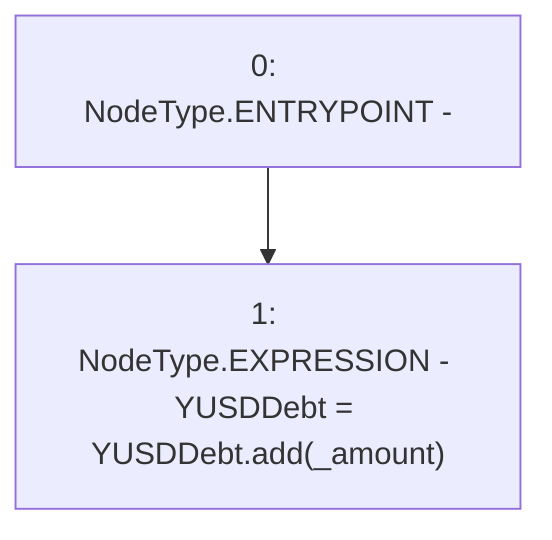

# Context: DefaultPoolTester.unprotectedIncreaseYUSDDebt

**Contract:** `DefaultPoolTester` (Inherits: DefaultPool, YetiCustomBase, BaseMath, IDefaultPool, IPool, ICollateralReceiver, CheckContract, Ownable)
**Signature:** `unprotectedIncreaseYUSDDebt(uint256)`
**Method Selector ID:** `0x0e8f67f7`
**Visibility:** `external`
**Environment-Free:** `Yes`
**Modifiers:** None

### State Variables Interaction
- **Reads:** YUSDDebt
- **Writes:** YUSDDebt

### Environment & Verification Flags
- **Uses Foundry Cheatcodes:** No
- **Has Echidna Properties:** No

### Internal Calls Tree
- None

### External Calls / Value Transfers
- `SafeMath.TMP_409(uint256) = LIBRARY_CALL, dest:SafeMath, function:SafeMath.add(uint256,uint256), arguments:['YUSDDebt', '_amount'] `

### Control Flow Graph (CFG)


### Source Mapping
Declared in: `certora-ac-datasets/detasets/web3bugs/dataset/web3bugs/66/packages/contracts/contracts/TestContracts/DefaultPoolTester.sol` on lines **9** to **11**

```solidity
    function unprotectedIncreaseYUSDDebt(uint _amount) external {
        YUSDDebt  = YUSDDebt.add(_amount);
    }

```
