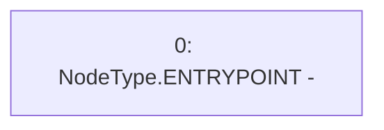

# Context: DefaultPoolTester.unprotectedPayable

**Contract:** `DefaultPoolTester` (Inherits: DefaultPool, YetiCustomBase, BaseMath, IDefaultPool, IPool, ICollateralReceiver, CheckContract, Ownable)
**Signature:** `unprotectedPayable()`
**Method Selector ID:** `0xf3af7c3b`
**Visibility:** `external`
**Environment-Free:** `Yes`
**Modifiers:** None

### State Variables Interaction
- **Reads:** None
- **Writes:** None

### Environment & Verification Flags
- **Uses Foundry Cheatcodes:** No
- **Has Echidna Properties:** No

### Internal Calls Tree
- None

### External Calls / Value Transfers
- None

### Control Flow Graph (CFG)


### Source Mapping
Declared in: `certora-ac-datasets/detasets/web3bugs/dataset/web3bugs/66/packages/contracts/contracts/TestContracts/DefaultPoolTester.sol` on lines **13** to **16**

```solidity
    function unprotectedPayable() external payable {
         // @KingYet: Commented
        // ETH = ETH.add(msg.value);
    }

```
