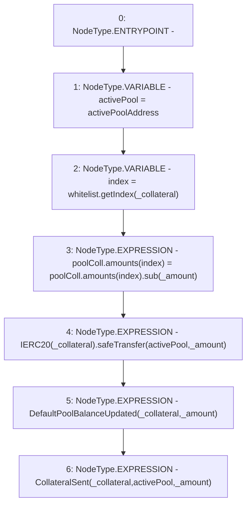

# Context: DefaultPool._sendCollateral

**Contract:** `DefaultPool` (Inherits: YetiCustomBase, BaseMath, IDefaultPool, IPool, ICollateralReceiver, CheckContract, Ownable)
**Signature:** `_sendCollateral(address,uint256)`
**Method Selector ID:** `Internal (No Method ID)`
**Visibility:** `internal`
**Environment-Free:** `Yes`
**Modifiers:** None

### State Variables Interaction
- **Reads:** activePoolAddress, poolColl, whitelist
- **Writes:** poolColl

### Environment & Verification Flags
- **Uses Foundry Cheatcodes:** No
- **Has Echidna Properties:** No

### Internal Calls Tree
- None

### External Calls / Value Transfers
- `SafeERC20.LIBRARY_CALL, dest:SafeERC20, function:SafeERC20.safeTransfer(IERC20,address,uint256), arguments:['TMP_86', 'activePool', '_amount'] `
- `IWhitelist.TMP_84(uint256) = HIGH_LEVEL_CALL, dest:whitelist(IWhitelist), function:getIndex, arguments:['_collateral']  `
- `SafeMath.TMP_85(uint256) = LIBRARY_CALL, dest:SafeMath, function:SafeMath.sub(uint256,uint256), arguments:['REF_120', '_amount'] `

### Control Flow Graph (CFG)


### Source Mapping
Declared in: `certora-ac-datasets/detasets/web3bugs/dataset/web3bugs/66/packages/contracts/contracts/DefaultPool.sol` on lines **119** to **128**

```solidity
    function _sendCollateral(address _collateral, uint256 _amount) internal {
        address activePool = activePoolAddress;
        uint256 index = whitelist.getIndex(_collateral);
        poolColl.amounts[index] = poolColl.amounts[index].sub(_amount);

        IERC20(_collateral).safeTransfer(activePool, _amount);

        emit DefaultPoolBalanceUpdated(_collateral, _amount);
        emit CollateralSent(_collateral, activePool, _amount);
    }

```
