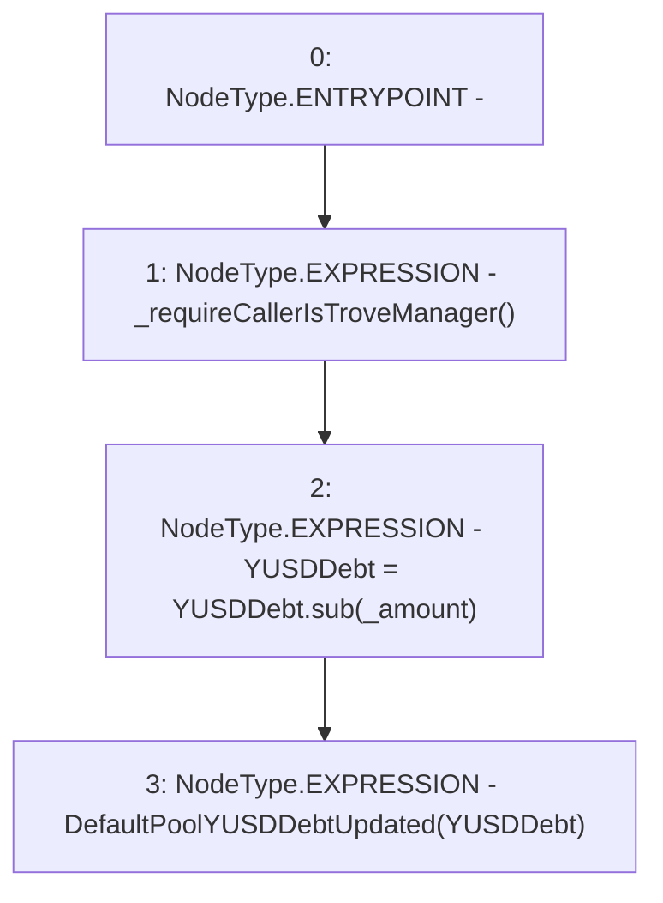

# Context: DefaultPool.decreaseYUSDDebt

**Contract:** `DefaultPool` (Inherits: YetiCustomBase, BaseMath, IDefaultPool, IPool, ICollateralReceiver, CheckContract, Ownable)
**Signature:** `decreaseYUSDDebt(uint256)`
**Method Selector ID:** `0xe7b1d678`
**Visibility:** `external`
**Environment-Free:** `No (reads EVM state context)`
**Modifiers:** None

### State Variables Interaction
- **Reads:** YUSDDebt
- **Writes:** YUSDDebt

### Environment & Verification Flags
- **Uses Foundry Cheatcodes:** No
- **Has Echidna Properties:** No

### Internal Calls Tree
- None

### External Calls / Value Transfers
- `SafeMath.TMP_110(uint256) = LIBRARY_CALL, dest:SafeMath, function:SafeMath.sub(uint256,uint256), arguments:['YUSDDebt', '_amount'] `

### Control Flow Graph (CFG)


### Source Mapping
Declared in: `certora-ac-datasets/detasets/web3bugs/dataset/web3bugs/66/packages/contracts/contracts/DefaultPool.sol` on lines **173** to **177**

```solidity
    function decreaseYUSDDebt(uint256 _amount) external override {
        _requireCallerIsTroveManager();
        YUSDDebt = YUSDDebt.sub(_amount);
        emit DefaultPoolYUSDDebtUpdated(YUSDDebt);
    }

```
