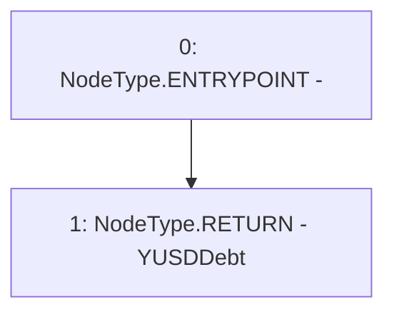

# Context: DefaultPool.getYUSDDebt

**Contract:** `DefaultPool` (Inherits: YetiCustomBase, BaseMath, IDefaultPool, IPool, ICollateralReceiver, CheckContract, Ownable)
**Signature:** `getYUSDDebt() returns (uint256)`
**Method Selector ID:** `0x8df70992`
**Visibility:** `external`
**Environment-Free:** `Yes`
**Modifiers:** None

### State Variables Interaction
- **Reads:** YUSDDebt
- **Writes:** None

### Environment & Verification Flags
- **Uses Foundry Cheatcodes:** No
- **Has Echidna Properties:** No

### Internal Calls Tree
- None

### External Calls / Value Transfers
- None

### Control Flow Graph (CFG)


### Source Mapping
Declared in: `certora-ac-datasets/detasets/web3bugs/dataset/web3bugs/66/packages/contracts/contracts/DefaultPool.sol` on lines **114** to **116**

```solidity
    function getYUSDDebt() external view override returns (uint256) {
        return YUSDDebt;
    }

```
