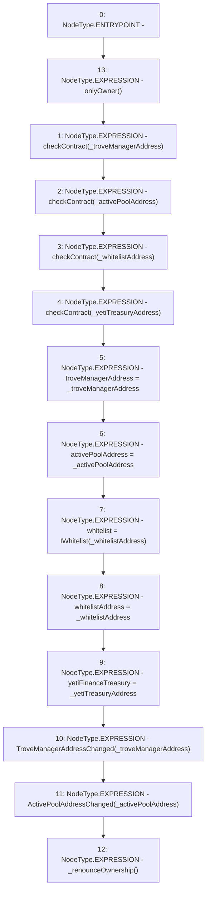

# Context: DefaultPool.setAddresses

**Contract:** `DefaultPool` (Inherits: YetiCustomBase, BaseMath, IDefaultPool, IPool, ICollateralReceiver, CheckContract, Ownable)
**Signature:** `setAddresses(address,address,address,address)`
**Method Selector ID:** `0x4a945f8d`
**Visibility:** `external`
**Environment-Free:** `No (reads EVM state context)`
**Modifiers:**
- `onlyOwner`
  ```solidity
  modifier onlyOwner() {
          require(isOwner(), "CallerNotOwner");
          _;
      }
  ```

### State Variables Interaction
- **Reads:** None
- **Writes:** activePoolAddress, troveManagerAddress, whitelist, whitelistAddress, yetiFinanceTreasury

### Environment & Verification Flags
- **Uses Foundry Cheatcodes:** No
- **Has Echidna Properties:** No

### Internal Calls Tree
- None

### External Calls / Value Transfers
- None

### Control Flow Graph (CFG)


### Source Mapping
Declared in: `certora-ac-datasets/detasets/web3bugs/dataset/web3bugs/66/packages/contracts/contracts/DefaultPool.sol` on lines **46** to **67**

```solidity
    function setAddresses(
        address _troveManagerAddress,
        address _activePoolAddress,
        address _whitelistAddress, 
        address _yetiTreasuryAddress
    ) external onlyOwner {
        checkContract(_troveManagerAddress);
        checkContract(_activePoolAddress);
        checkContract(_whitelistAddress);
        checkContract(_yetiTreasuryAddress);

        troveManagerAddress = _troveManagerAddress;
        activePoolAddress = _activePoolAddress;
        whitelist = IWhitelist(_whitelistAddress);
        whitelistAddress = _whitelistAddress;
        yetiFinanceTreasury = _yetiTreasuryAddress;

        emit TroveManagerAddressChanged(_troveManagerAddress);
        emit ActivePoolAddressChanged(_activePoolAddress);

        _renounceOwnership();
    }

```
