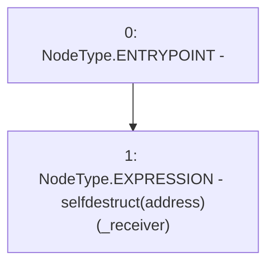

# Context: Destructible.destruct

**Contract:** `Destructible` (Inherits: None)
**Signature:** `destruct(address)`
**Method Selector ID:** `0x1beb2615`
**Visibility:** `external`
**Environment-Free:** `Yes`
**Modifiers:** None

### State Variables Interaction
- **Reads:** None
- **Writes:** None

### Environment & Verification Flags
- **Uses Foundry Cheatcodes:** No
- **Has Echidna Properties:** No

### Internal Calls Tree
- None

### External Calls / Value Transfers
- None

### Control Flow Graph (CFG)


### Source Mapping
Declared in: `certora-ac-datasets/detasets/web3bugs/dataset/web3bugs/66/packages/contracts/contracts/TestContracts/Destructible.sol` on lines **9** to **11**

```solidity
    function destruct(address payable _receiver) external {
        selfdestruct(_receiver);
    }

```
