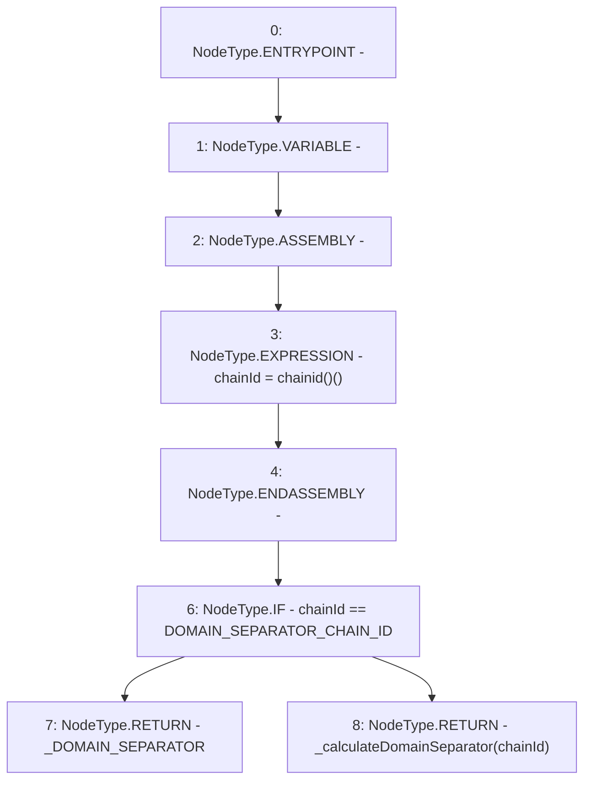

# Context: Domain._domainSeparator

**Contract:** `Domain` (Inherits: None)
**Signature:** `_domainSeparator() returns (bytes32)`
**Method Selector ID:** `Internal (No Method ID)`
**Visibility:** `internal`
**Environment-Free:** `Yes`
**Modifiers:** None

### State Variables Interaction
- **Reads:** DOMAIN_SEPARATOR_CHAIN_ID, _DOMAIN_SEPARATOR
- **Writes:** None

### Environment & Verification Flags
- **Uses Foundry Cheatcodes:** No
- **Has Echidna Properties:** No

### Internal Calls Tree
- None

### External Calls / Value Transfers
- None

### Control Flow Graph (CFG)


### Source Mapping
Declared in: `certora-ac-datasets/detasets/web3bugs/dataset/web3bugs/66/packages/contracts/contracts/YETI/BoringCrypto/Domain.sol` on lines **38** to **41**

```solidity
    function _domainSeparator() internal view returns (bytes32) {
        uint256 chainId; assembly {chainId := chainid()}
        return chainId == DOMAIN_SEPARATOR_CHAIN_ID ? _DOMAIN_SEPARATOR : _calculateDomainSeparator(chainId);
    }

```
