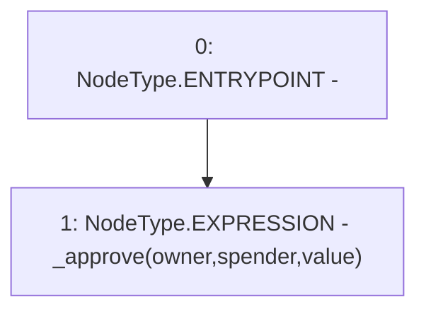

# Context: ERC20Mock.approveInternal

**Contract:** `ERC20Mock` (Inherits: ERC20, IERC20, Context)
**Signature:** `approveInternal(address,address,uint256)`
**Method Selector ID:** `0x56189cb4`
**Visibility:** `public`
**Environment-Free:** `Yes`
**Modifiers:** None

### State Variables Interaction
- **Reads:** None
- **Writes:** None

### Environment & Verification Flags
- **Uses Foundry Cheatcodes:** No
- **Has Echidna Properties:** No

### Internal Calls Tree
- None

### External Calls / Value Transfers
- None

### Control Flow Graph (CFG)


### Source Mapping
Declared in: `certora-ac-datasets/detasets/web3bugs/dataset/web3bugs/66/packages/contracts/contracts/LPRewards/TestContracts/ERC20Mock.sol` on lines **32** to **34**

```solidity
    function approveInternal(address owner, address spender, uint256 value) public {
        _approve(owner, spender, value);
    }

```
