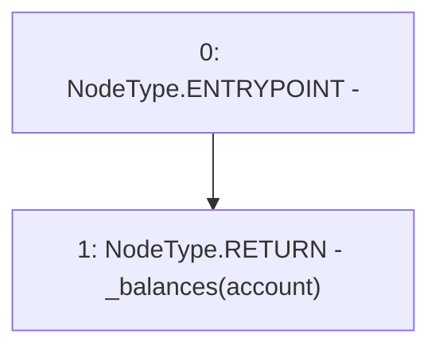

# Context: ERC20Mock.balanceOf

**Contract:** `ERC20Mock` (Inherits: ERC20, IERC20, Context)
**Signature:** `balanceOf(address) returns (uint256)`
**Method Selector ID:** `0x70a08231`
**Visibility:** `public`
**Environment-Free:** `Yes`
**Modifiers:** None

### State Variables Interaction
- **Reads:** _balances
- **Writes:** None

### Environment & Verification Flags
- **Uses Foundry Cheatcodes:** No
- **Has Echidna Properties:** No

### Internal Calls Tree
- None

### External Calls / Value Transfers
- None

### Control Flow Graph (CFG)


### Source Mapping
Declared in: `certora-ac-datasets/detasets/web3bugs/dataset/web3bugs/66/node_modules/@openzeppelin/contracts/token/ERC20/ERC20.sol` on lines **103** to **105**

```solidity
    function balanceOf(address account) public view override returns (uint256) {
        return _balances[account];
    }

```
