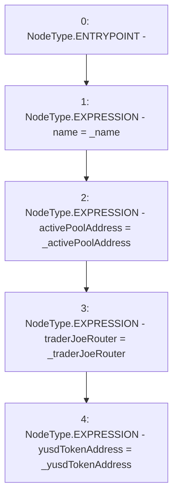

# Context: ERC20Router.constructor

**Contract:** `ERC20Router` (Inherits: IYetiRouter)
**Signature:** `constructor(string,address,address,address)`
**Method Selector ID:** `0x0077405b`
**Visibility:** `public`
**Environment-Free:** `Yes`
**Modifiers:** None

### State Variables Interaction
- **Reads:** None
- **Writes:** activePoolAddress, name, traderJoeRouter, yusdTokenAddress

### Environment & Verification Flags
- **Uses Foundry Cheatcodes:** No
- **Has Echidna Properties:** No

### Internal Calls Tree
- None

### External Calls / Value Transfers
- None

### Control Flow Graph (CFG)


### Source Mapping
Declared in: `certora-ac-datasets/detasets/web3bugs/dataset/web3bugs/66/packages/contracts/contracts/Routers/ERC20Router.sol` on lines **20** to **30**

```solidity
    constructor(
        string memory _name,
        address _activePoolAddress,
        address _traderJoeRouter, 
        address _yusdTokenAddress
    ) public {
        name = _name;
        activePoolAddress = _activePoolAddress;
        traderJoeRouter = _traderJoeRouter;
        yusdTokenAddress = _yusdTokenAddress;
    }

```
