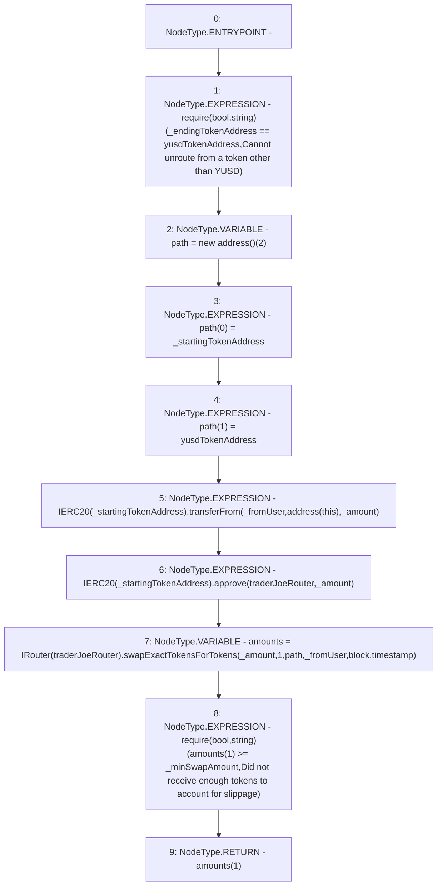

# Context: ERC20Router.unRoute

**Contract:** `ERC20Router` (Inherits: IYetiRouter)
**Signature:** `unRoute(address,address,address,uint256,uint256) returns (uint256)`
**Method Selector ID:** `0xa7b8a537`
**Visibility:** `external`
**Environment-Free:** `No (reads EVM state context)`
**Modifiers:** None

### State Variables Interaction
- **Reads:** traderJoeRouter, yusdTokenAddress
- **Writes:** None

### Assertion Checks & Business Requirements
- require/assert: `require(bool,string)(_endingTokenAddress == yusdTokenAddress,Cannot unroute from a token other than YUSD)`
- require/assert: `require(bool,string)(amounts[1] >= _minSwapAmount,Did not receive enough tokens to account for slippage)`

### Environment & Verification Flags
- **Uses Foundry Cheatcodes:** No
- **Has Echidna Properties:** No

### Internal Calls Tree
- None

### External Calls / Value Transfers
- `IERC20.TMP_44(bool) = HIGH_LEVEL_CALL, dest:TMP_42(IERC20), function:transferFrom, arguments:['_fromUser', 'TMP_43', '_amount']  `
- `IERC20.TMP_46(bool) = HIGH_LEVEL_CALL, dest:TMP_45(IERC20), function:approve, arguments:['traderJoeRouter', '_amount']  `
- `IRouter.TMP_48(uint256[]) = HIGH_LEVEL_CALL, dest:TMP_47(IRouter), function:swapExactTokensForTokens, arguments:['_amount', '1', 'path', '_fromUser', 'block.timestamp']  `

### Control Flow Graph (CFG)


### Source Mapping
Declared in: `certora-ac-datasets/detasets/web3bugs/dataset/web3bugs/66/packages/contracts/contracts/Routers/ERC20Router.sol` on lines **65** to **95**

```solidity
    function unRoute(
        address _fromUser,
        address _startingTokenAddress,
        address _endingTokenAddress,
        uint256 _amount,
        uint256 _minSwapAmount
    ) external override returns (uint256) {
        require(
            _endingTokenAddress == yusdTokenAddress,
            "Cannot unroute from a token other than YUSD"
        );
        address[] memory path = new address[](2);
        path[0] = _startingTokenAddress;
        path[1] = yusdTokenAddress;
        IERC20(_startingTokenAddress).transferFrom(_fromUser, address(this), _amount);
        IERC20(_startingTokenAddress).approve(traderJoeRouter, _amount);
        uint256[] memory amounts = IRouter(traderJoeRouter).swapExactTokensForTokens(
            _amount,
            1,
            path,
            _fromUser,
            block.timestamp
        );
        require(
            amounts[1] >= _minSwapAmount,
            "Did not receive enough tokens to account for slippage"
        );

        return amounts[1];

    }

```
