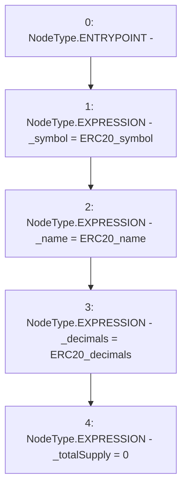

# Context: ERC20Token.constructor

**Contract:** `ERC20Token` (Inherits: None)
**Signature:** `constructor(string,string,uint8)`
**Method Selector ID:** `0x5181b956`
**Visibility:** `public`
**Environment-Free:** `Yes`
**Modifiers:** None

### State Variables Interaction
- **Reads:** None
- **Writes:** _decimals, _name, _symbol, _totalSupply

### Environment & Verification Flags
- **Uses Foundry Cheatcodes:** No
- **Has Echidna Properties:** No

### Internal Calls Tree
- None

### External Calls / Value Transfers
- None

### Control Flow Graph (CFG)


### Source Mapping
Declared in: `certora-ac-datasets/detasets/web3bugs/dataset/web3bugs/66/packages/contracts/contracts/TestContracts/TestAssets/ERC20Token.sol` on lines **184** to **189**

```solidity
    constructor(string memory ERC20_symbol, string memory ERC20_name, uint8 ERC20_decimals) public {
        _symbol = ERC20_symbol;
        _name = ERC20_name;
        _decimals = ERC20_decimals;
        _totalSupply = 0;
    }

```
