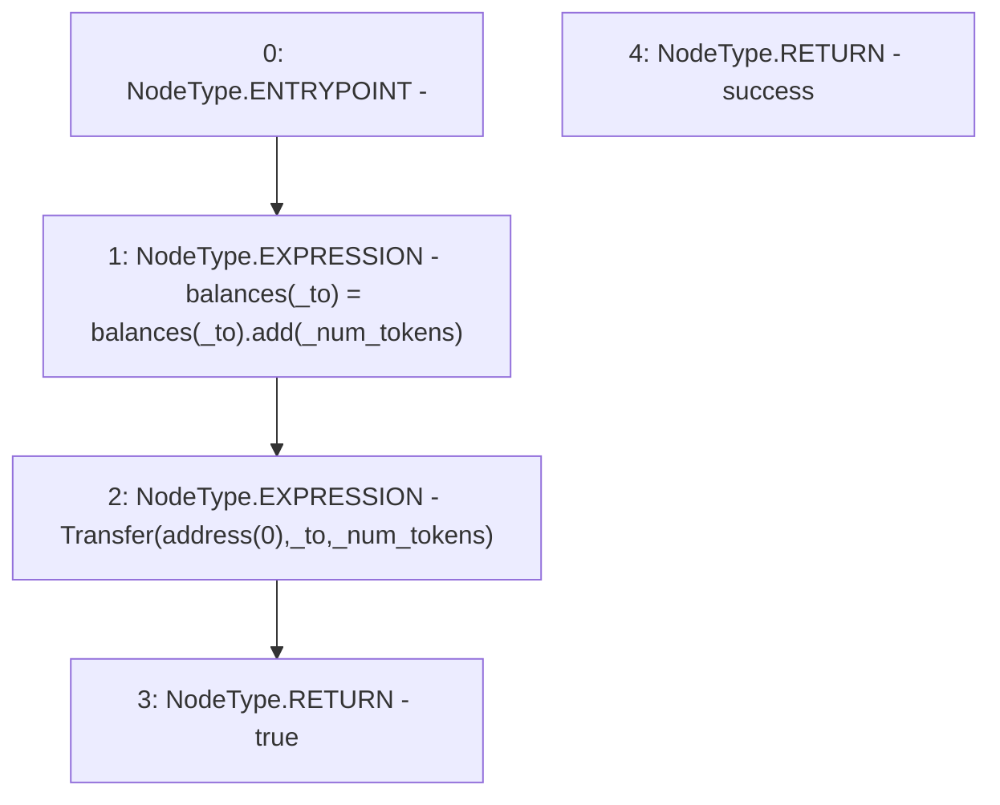

# Context: ERC20Token.mint

**Contract:** `ERC20Token` (Inherits: None)
**Signature:** `mint(address,uint256) returns (bool)`
**Method Selector ID:** `0x40c10f19`
**Visibility:** `public`
**Environment-Free:** `Yes`
**Modifiers:** None

### State Variables Interaction
- **Reads:** balances
- **Writes:** balances

### Environment & Verification Flags
- **Uses Foundry Cheatcodes:** No
- **Has Echidna Properties:** No

### Internal Calls Tree
- None

### External Calls / Value Transfers
- `SafeMath.TMP_25(uint256) = LIBRARY_CALL, dest:SafeMath, function:SafeMath.add(uint256,uint256), arguments:['REF_9', '_num_tokens'] `

### Control Flow Graph (CFG)


### Source Mapping
Declared in: `certora-ac-datasets/detasets/web3bugs/dataset/web3bugs/66/packages/contracts/contracts/TestContracts/TestAssets/ERC20Token.sol` on lines **239** to **243**

```solidity
    function mint(address _to, uint _num_tokens) public returns (bool success) {
        balances[_to] = balances[_to].add(_num_tokens);
        emit Transfer(address(0), _to, _num_tokens);
        return true;
    }

```
