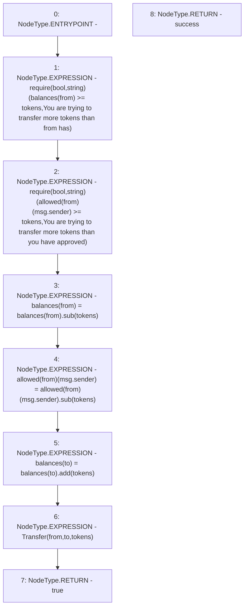

# Context: ERC20Token.transferFrom

**Contract:** `ERC20Token` (Inherits: None)
**Signature:** `transferFrom(address,address,uint256) returns (bool)`
**Method Selector ID:** `0x23b872dd`
**Visibility:** `public`
**Environment-Free:** `No (reads EVM state context)`
**Modifiers:** None

### State Variables Interaction
- **Reads:** allowed, balances
- **Writes:** allowed, balances

### Assertion Checks & Business Requirements
- require/assert: `require(bool,string)(balances[from] >= tokens,You are trying to transfer more tokens than from has)`
- require/assert: `require(bool,string)(allowed[from][msg.sender] >= tokens,You are trying to transfer more tokens than you have approved)`

### Environment & Verification Flags
- **Uses Foundry Cheatcodes:** No
- **Has Echidna Properties:** No

### Internal Calls Tree
- None

### External Calls / Value Transfers
- `SafeMath.TMP_35(uint256) = LIBRARY_CALL, dest:SafeMath, function:SafeMath.add(uint256,uint256), arguments:['REF_25', 'tokens'] `
- `TMP_30(None) = SOLIDITY_CALL require(bool,string)(TMP_29,You are trying to transfer more tokens than from has)`
- `SafeMath.TMP_33(uint256) = LIBRARY_CALL, dest:SafeMath, function:SafeMath.sub(uint256,uint256), arguments:['REF_17', 'tokens'] `
- `SafeMath.TMP_34(uint256) = LIBRARY_CALL, dest:SafeMath, function:SafeMath.sub(uint256,uint256), arguments:['REF_22', 'tokens'] `
- `TMP_32(None) = SOLIDITY_CALL require(bool,string)(TMP_31,You are trying to transfer more tokens than you have approved)`

### Control Flow Graph (CFG)


### Source Mapping
Declared in: `certora-ac-datasets/detasets/web3bugs/dataset/web3bugs/66/packages/contracts/contracts/TestContracts/TestAssets/ERC20Token.sol` on lines **270** to **278**

```solidity
    function transferFrom(address from, address to, uint tokens) public returns (bool success) {
        require(balances[from] >= tokens, "You are trying to transfer more tokens than from has");
        require(allowed[from][msg.sender] >= tokens, "You are trying to transfer more tokens than you have approved");
        balances[from] = balances[from].sub(tokens);
        allowed[from][msg.sender] = allowed[from][msg.sender].sub(tokens);
        balances[to] = balances[to].add(tokens);
        emit Transfer(from, to, tokens);
        return true;
    }

```
