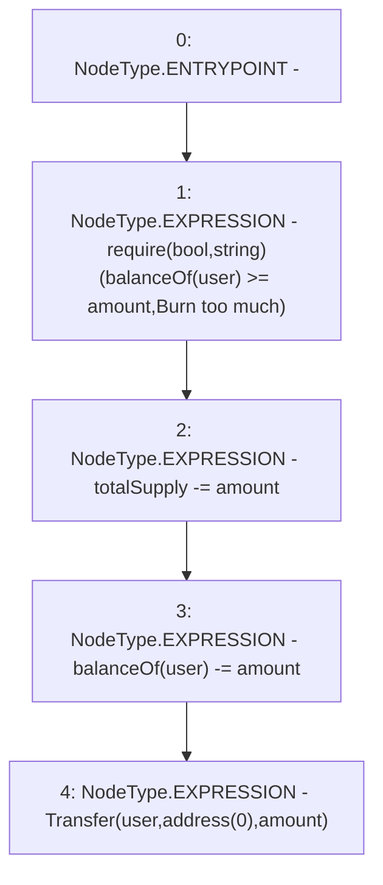

# Context: ERC20WithSupply._burn

**Contract:** `ERC20WithSupply` (Inherits: ERC20, Domain, IERC20)
**Signature:** `_burn(address,uint256)`
**Method Selector ID:** `Internal (No Method ID)`
**Visibility:** `internal`
**Environment-Free:** `Yes`
**Modifiers:** None

### State Variables Interaction
- **Reads:** balanceOf, totalSupply
- **Writes:** balanceOf, totalSupply

### Assertion Checks & Business Requirements
- require/assert: `require(bool,string)(balanceOf[user] >= amount,Burn too much)`

### Environment & Verification Flags
- **Uses Foundry Cheatcodes:** No
- **Has Echidna Properties:** No

### Internal Calls Tree
- None

### External Calls / Value Transfers
- None

### Control Flow Graph (CFG)


### Source Mapping
Declared in: `certora-ac-datasets/detasets/web3bugs/dataset/web3bugs/66/packages/contracts/contracts/YETI/BoringCrypto/ERC20.sol` on lines **147** to **152**

```solidity
    function _burn(address user, uint256 amount) internal {
        require(balanceOf[user] >= amount, "Burn too much");
        totalSupply -= amount;
        balanceOf[user] -= amount;
        emit Transfer(user, address(0), amount);
    }

```
