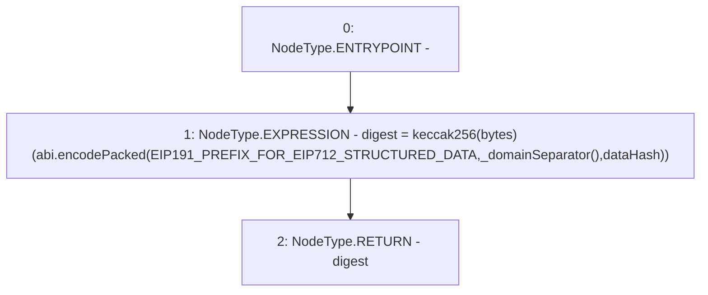

# Context: ERC20WithSupply._getDigest

**Contract:** `ERC20WithSupply` (Inherits: ERC20, Domain, IERC20)
**Signature:** `_getDigest(bytes32) returns (bytes32)`
**Method Selector ID:** `Internal (No Method ID)`
**Visibility:** `internal`
**Environment-Free:** `Yes`
**Modifiers:** None

### State Variables Interaction
- **Reads:** EIP191_PREFIX_FOR_EIP712_STRUCTURED_DATA
- **Writes:** None

### Environment & Verification Flags
- **Uses Foundry Cheatcodes:** No
- **Has Echidna Properties:** No

### Internal Calls Tree
- None

### External Calls / Value Transfers
- None

### Control Flow Graph (CFG)


### Source Mapping
Declared in: `certora-ac-datasets/detasets/web3bugs/dataset/web3bugs/66/packages/contracts/contracts/YETI/BoringCrypto/Domain.sol` on lines **43** to **52**

```solidity
    function _getDigest(bytes32 dataHash) internal view returns (bytes32 digest) {
        digest =
        keccak256(
            abi.encodePacked(
                EIP191_PREFIX_FOR_EIP712_STRUCTURED_DATA,
                _domainSeparator(),
                dataHash
            )
        );
    }

```
