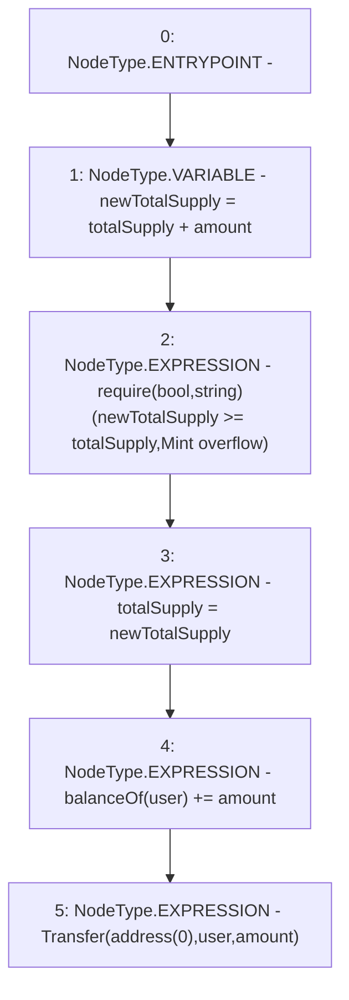

# Context: ERC20WithSupply._mint

**Contract:** `ERC20WithSupply` (Inherits: ERC20, Domain, IERC20)
**Signature:** `_mint(address,uint256)`
**Method Selector ID:** `Internal (No Method ID)`
**Visibility:** `internal`
**Environment-Free:** `Yes`
**Modifiers:** None

### State Variables Interaction
- **Reads:** balanceOf, totalSupply
- **Writes:** balanceOf, totalSupply

### Assertion Checks & Business Requirements
- require/assert: `require(bool,string)(newTotalSupply >= totalSupply,Mint overflow)`

### Environment & Verification Flags
- **Uses Foundry Cheatcodes:** No
- **Has Echidna Properties:** No

### Internal Calls Tree
- None

### External Calls / Value Transfers
- None

### Control Flow Graph (CFG)


### Source Mapping
Declared in: `certora-ac-datasets/detasets/web3bugs/dataset/web3bugs/66/packages/contracts/contracts/YETI/BoringCrypto/ERC20.sol` on lines **139** to **145**

```solidity
    function _mint(address user, uint256 amount) internal {
        uint256 newTotalSupply = totalSupply + amount;
        require(newTotalSupply >= totalSupply, "Mint overflow");
        totalSupply = newTotalSupply;
        balanceOf[user] += amount;
        emit Transfer(address(0), user, amount);
    }

```
