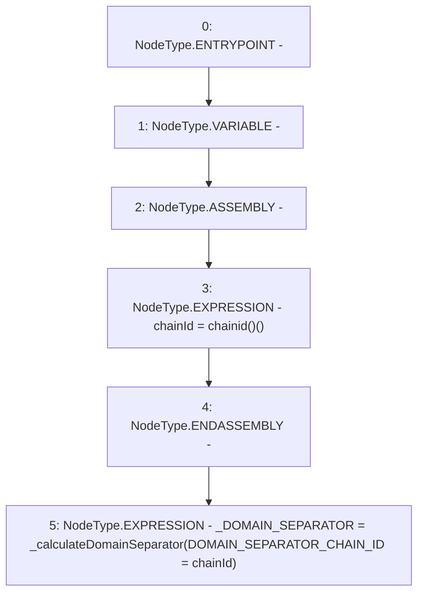

# Context: ERC20WithSupply.constructor

**Contract:** `ERC20WithSupply` (Inherits: ERC20, Domain, IERC20)
**Signature:** `constructor()`
**Method Selector ID:** `0x90fa17bb`
**Visibility:** `public`
**Environment-Free:** `Yes`
**Modifiers:** None

### State Variables Interaction
- **Reads:** DOMAIN_SEPARATOR_CHAIN_ID
- **Writes:** DOMAIN_SEPARATOR_CHAIN_ID, _DOMAIN_SEPARATOR

### Environment & Verification Flags
- **Uses Foundry Cheatcodes:** No
- **Has Echidna Properties:** No

### Internal Calls Tree
- None

### External Calls / Value Transfers
- None

### Control Flow Graph (CFG)


### Source Mapping
Declared in: `certora-ac-datasets/detasets/web3bugs/dataset/web3bugs/66/packages/contracts/contracts/YETI/BoringCrypto/Domain.sol` on lines **29** to **32**

```solidity
    constructor() public {
        uint256 chainId; assembly {chainId := chainid()}
        _DOMAIN_SEPARATOR = _calculateDomainSeparator(DOMAIN_SEPARATOR_CHAIN_ID = chainId);
    }

```
