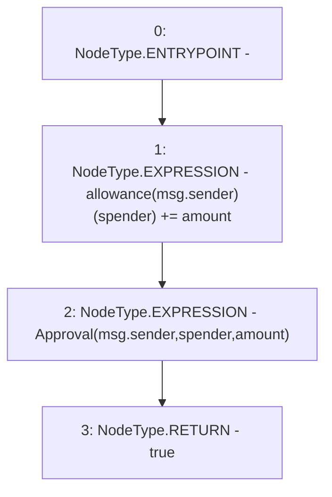

# Context: ERC20WithSupply.increaseAllowance

**Contract:** `ERC20WithSupply` (Inherits: ERC20, Domain, IERC20)
**Signature:** `increaseAllowance(address,uint256) returns (bool)`
**Method Selector ID:** `0x39509351`
**Visibility:** `public`
**Environment-Free:** `No (reads EVM state context)`
**Modifiers:** None

### State Variables Interaction
- **Reads:** allowance
- **Writes:** allowance

### Environment & Verification Flags
- **Uses Foundry Cheatcodes:** No
- **Has Echidna Properties:** No

### Internal Calls Tree
- None

### External Calls / Value Transfers
- None

### Control Flow Graph (CFG)


### Source Mapping
Declared in: `certora-ac-datasets/detasets/web3bugs/dataset/web3bugs/66/packages/contracts/contracts/YETI/BoringCrypto/ERC20.sol` on lines **96** to **100**

```solidity
    function increaseAllowance(address spender, uint256 amount) public override returns (bool) {
        allowance[msg.sender][spender] += amount;
        emit Approval(msg.sender, spender, amount);
        return true;
    }

```
