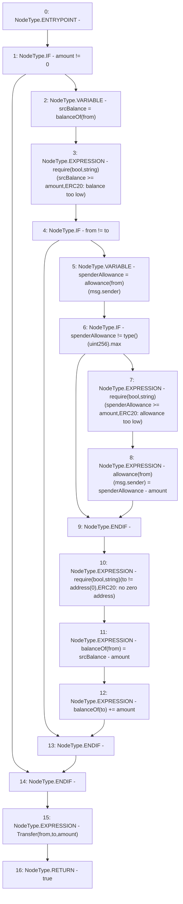

# Context: ERC20WithSupply.transferFrom

**Contract:** `ERC20WithSupply` (Inherits: ERC20, Domain, IERC20)
**Signature:** `transferFrom(address,address,uint256) returns (bool)`
**Method Selector ID:** `0x23b872dd`
**Visibility:** `public`
**Environment-Free:** `No (reads EVM state context)`
**Modifiers:** None

### State Variables Interaction
- **Reads:** allowance, balanceOf
- **Writes:** allowance, balanceOf

### Assertion Checks & Business Requirements
- require/assert: `require(bool,string)(srcBalance >= amount,ERC20: balance too low)`
- require/assert: `require(bool,string)(spenderAllowance >= amount,ERC20: allowance too low)`
- require/assert: `require(bool,string)(to != address(0),ERC20: no zero address)`

### Environment & Verification Flags
- **Uses Foundry Cheatcodes:** No
- **Has Echidna Properties:** No

### Internal Calls Tree
- None

### External Calls / Value Transfers
- None

### Control Flow Graph (CFG)


### Source Mapping
Declared in: `certora-ac-datasets/detasets/web3bugs/dataset/web3bugs/66/packages/contracts/contracts/YETI/BoringCrypto/ERC20.sol` on lines **55** to **80**

```solidity
    function transferFrom(
        address from,
        address to,
        uint256 amount
    ) public returns (bool) {
        // If `amount` is 0, or `from` is `to` nothing happens
        if (amount != 0) {
            uint256 srcBalance = balanceOf[from];
            require(srcBalance >= amount, "ERC20: balance too low");

            if (from != to) {
                uint256 spenderAllowance = allowance[from][msg.sender];
                // If allowance is infinite, don't decrease it to save on gas (breaks with EIP-20).
                if (spenderAllowance != type(uint256).max) {
                    require(spenderAllowance >= amount, "ERC20: allowance too low");
                    allowance[from][msg.sender] = spenderAllowance - amount; // Underflow is checked
                }
                require(to != address(0), "ERC20: no zero address"); // Moved down so other failed calls safe some gas

                balanceOf[from] = srcBalance - amount; // Underflow is checked
                balanceOf[to] += amount;
            }
        }
        emit Transfer(from, to, amount);
        return true;
    }

```
