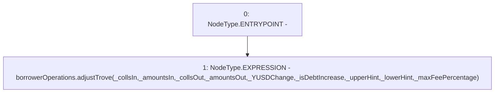

# Context: EchidnaProxy.adjustTrovePrx

**Contract:** `EchidnaProxy` (Inherits: None)
**Signature:** `adjustTrovePrx(address[],uint256[],address[],uint256[],uint256,bool,address,address,uint256)`
**Method Selector ID:** `0x09c52dea`
**Visibility:** `external`
**Environment-Free:** `Yes`
**Modifiers:** None

### State Variables Interaction
- **Reads:** borrowerOperations
- **Writes:** None

### Environment & Verification Flags
- **Uses Foundry Cheatcodes:** No
- **Has Echidna Properties:** No

### Internal Calls Tree
- None

### External Calls / Value Transfers
- `BorrowerOperations.HIGH_LEVEL_CALL, dest:borrowerOperations(BorrowerOperations), function:adjustTrove, arguments:['_collsIn', '_amountsIn', '_collsOut', '_amountsOut', '_YUSDChange', '_isDebtIncrease', '_upperHint', '_lowerHint', '_maxFeePercentage']  `

### Control Flow Graph (CFG)


### Source Mapping
Declared in: `certora-ac-datasets/detasets/web3bugs/dataset/web3bugs/66/packages/contracts/contracts/TestContracts/EchidnaProxy.sol` on lines **102** to **117**

```solidity
    function adjustTrovePrx(
        address[] memory _collsIn,
        uint[] memory _amountsIn,
        address[] memory _collsOut,
        uint[] memory _amountsOut,
        uint _YUSDChange,
        bool _isDebtIncrease,
        address _upperHint,
        address _lowerHint,
        uint _maxFeePercentage) external {
        borrowerOperations.adjustTrove(
            _collsIn,
            _amountsIn,
            _collsOut, _amountsOut, _YUSDChange, _isDebtIncrease, _upperHint, _lowerHint, _maxFeePercentage
        );
    }

```
