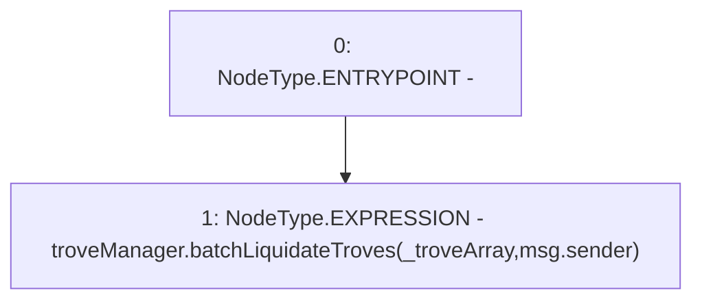

# Context: EchidnaProxy.batchLiquidateTrovesPrx

**Contract:** `EchidnaProxy` (Inherits: None)
**Signature:** `batchLiquidateTrovesPrx(address[])`
**Method Selector ID:** `0x4afbac51`
**Visibility:** `external`
**Environment-Free:** `No (reads EVM state context)`
**Modifiers:** None

### State Variables Interaction
- **Reads:** troveManager
- **Writes:** None

### Environment & Verification Flags
- **Uses Foundry Cheatcodes:** No
- **Has Echidna Properties:** No

### Internal Calls Tree
- None

### External Calls / Value Transfers
- `TroveManager.HIGH_LEVEL_CALL, dest:troveManager(TroveManager), function:batchLiquidateTroves, arguments:['_troveArray', 'msg.sender']  `

### Control Flow Graph (CFG)


### Source Mapping
Declared in: `certora-ac-datasets/detasets/web3bugs/dataset/web3bugs/66/packages/contracts/contracts/TestContracts/EchidnaProxy.sol` on lines **44** to **46**

```solidity
    function batchLiquidateTrovesPrx(address[] calldata _troveArray) external {
        troveManager.batchLiquidateTroves(_troveArray, msg.sender);
    }

```
