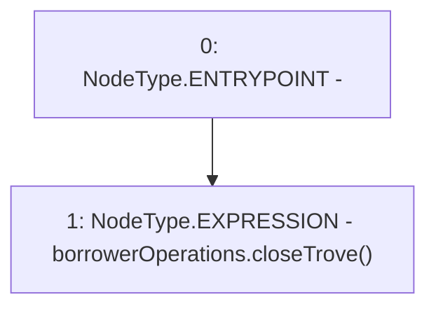

# Context: EchidnaProxy.closeTrovePrx

**Contract:** `EchidnaProxy` (Inherits: None)
**Signature:** `closeTrovePrx()`
**Method Selector ID:** `0x4903a3dd`
**Visibility:** `external`
**Environment-Free:** `Yes`
**Modifiers:** None

### State Variables Interaction
- **Reads:** borrowerOperations
- **Writes:** None

### Environment & Verification Flags
- **Uses Foundry Cheatcodes:** No
- **Has Echidna Properties:** No

### Internal Calls Tree
- None

### External Calls / Value Transfers
- `BorrowerOperations.HIGH_LEVEL_CALL, dest:borrowerOperations(BorrowerOperations), function:closeTrove, arguments:[]  `

### Control Flow Graph (CFG)


### Source Mapping
Declared in: `certora-ac-datasets/detasets/web3bugs/dataset/web3bugs/66/packages/contracts/contracts/TestContracts/EchidnaProxy.sol` on lines **98** to **100**

```solidity
    function closeTrovePrx() external {
        borrowerOperations.closeTrove();
    }

```
