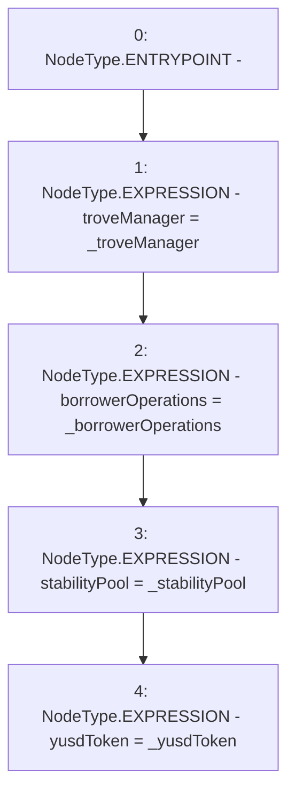

# Context: EchidnaProxy.constructor

**Contract:** `EchidnaProxy` (Inherits: None)
**Signature:** `constructor(TroveManager,BorrowerOperations,StabilityPool,YUSDToken)`
**Method Selector ID:** `0xb0647061`
**Visibility:** `public`
**Environment-Free:** `Yes`
**Modifiers:** None

### State Variables Interaction
- **Reads:** None
- **Writes:** borrowerOperations, stabilityPool, troveManager, yusdToken

### Environment & Verification Flags
- **Uses Foundry Cheatcodes:** No
- **Has Echidna Properties:** No

### Internal Calls Tree
- None

### External Calls / Value Transfers
- None

### Control Flow Graph (CFG)


### Source Mapping
Declared in: `certora-ac-datasets/detasets/web3bugs/dataset/web3bugs/66/packages/contracts/contracts/TestContracts/EchidnaProxy.sol` on lines **16** to **26**

```solidity
    constructor(
        TroveManager _troveManager,
        BorrowerOperations _borrowerOperations,
        StabilityPool _stabilityPool,
        YUSDToken _yusdToken
    ) public {
        troveManager = _troveManager;
        borrowerOperations = _borrowerOperations;
        stabilityPool = _stabilityPool;
        yusdToken = _yusdToken;
    }

```
