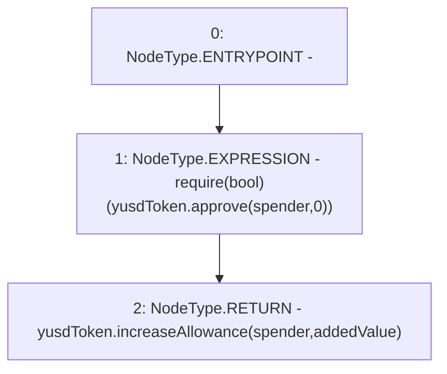

# Context: EchidnaProxy.increaseAllowancePrx

**Contract:** `EchidnaProxy` (Inherits: None)
**Signature:** `increaseAllowancePrx(address,uint256) returns (bool)`
**Method Selector ID:** `0xcc51a6c2`
**Visibility:** `external`
**Environment-Free:** `Yes`
**Modifiers:** None

### State Variables Interaction
- **Reads:** yusdToken
- **Writes:** None

### Assertion Checks & Business Requirements
- require/assert: `require(bool)(yusdToken.approve(spender,0))`

### Environment & Verification Flags
- **Uses Foundry Cheatcodes:** No
- **Has Echidna Properties:** No

### Internal Calls Tree
- None

### External Calls / Value Transfers
- `YUSDToken.TMP_2027(bool) = HIGH_LEVEL_CALL, dest:yusdToken(YUSDToken), function:approve, arguments:['spender', '0']  `
- `YUSDToken.TMP_2029(bool) = HIGH_LEVEL_CALL, dest:yusdToken(YUSDToken), function:increaseAllowance, arguments:['spender', 'addedValue']  `

### Control Flow Graph (CFG)


### Source Mapping
Declared in: `certora-ac-datasets/detasets/web3bugs/dataset/web3bugs/66/packages/contracts/contracts/TestContracts/EchidnaProxy.sol` on lines **142** to **145**

```solidity
    function increaseAllowancePrx(address spender, uint256 addedValue) external returns (bool) {
        require(yusdToken.approve(spender, 0));
        return yusdToken.increaseAllowance(spender, addedValue);
    }

```
