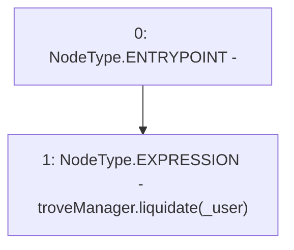

# Context: EchidnaProxy.liquidatePrx

**Contract:** `EchidnaProxy` (Inherits: None)
**Signature:** `liquidatePrx(address)`
**Method Selector ID:** `0x4d37261f`
**Visibility:** `external`
**Environment-Free:** `Yes`
**Modifiers:** None

### State Variables Interaction
- **Reads:** troveManager
- **Writes:** None

### Environment & Verification Flags
- **Uses Foundry Cheatcodes:** No
- **Has Echidna Properties:** No

### Internal Calls Tree
- None

### External Calls / Value Transfers
- `TroveManager.HIGH_LEVEL_CALL, dest:troveManager(TroveManager), function:liquidate, arguments:['_user']  `

### Control Flow Graph (CFG)


### Source Mapping
Declared in: `certora-ac-datasets/detasets/web3bugs/dataset/web3bugs/66/packages/contracts/contracts/TestContracts/EchidnaProxy.sol` on lines **34** to **36**

```solidity
    function liquidatePrx(address _user) external {
        troveManager.liquidate(_user);
    }

```
