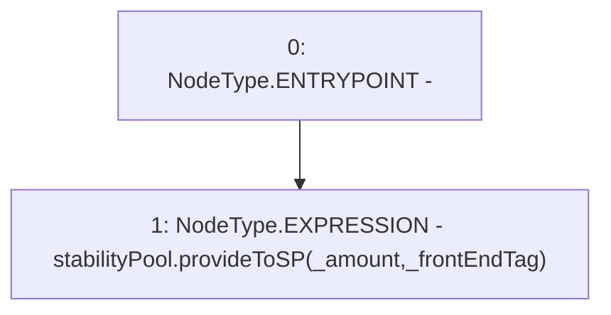

# Context: EchidnaProxy.provideToSPPrx

**Contract:** `EchidnaProxy` (Inherits: None)
**Signature:** `provideToSPPrx(uint256,address)`
**Method Selector ID:** `0x4c36240b`
**Visibility:** `external`
**Environment-Free:** `Yes`
**Modifiers:** None

### State Variables Interaction
- **Reads:** stabilityPool
- **Writes:** None

### Environment & Verification Flags
- **Uses Foundry Cheatcodes:** No
- **Has Echidna Properties:** No

### Internal Calls Tree
- None

### External Calls / Value Transfers
- `StabilityPool.HIGH_LEVEL_CALL, dest:stabilityPool(StabilityPool), function:provideToSP, arguments:['_amount', '_frontEndTag']  `

### Control Flow Graph (CFG)


### Source Mapping
Declared in: `certora-ac-datasets/detasets/web3bugs/dataset/web3bugs/66/packages/contracts/contracts/TestContracts/EchidnaProxy.sol` on lines **120** to **122**

```solidity
    function provideToSPPrx(uint _amount, address _frontEndTag) external {
        stabilityPool.provideToSP(_amount, _frontEndTag);
    }

```
