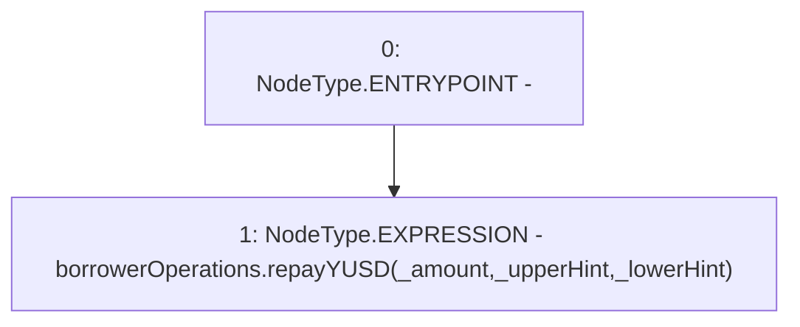

# Context: EchidnaProxy.repayYUSDPrx

**Contract:** `EchidnaProxy` (Inherits: None)
**Signature:** `repayYUSDPrx(uint256,address,address)`
**Method Selector ID:** `0x27d8b185`
**Visibility:** `external`
**Environment-Free:** `Yes`
**Modifiers:** None

### State Variables Interaction
- **Reads:** borrowerOperations
- **Writes:** None

### Environment & Verification Flags
- **Uses Foundry Cheatcodes:** No
- **Has Echidna Properties:** No

### Internal Calls Tree
- None

### External Calls / Value Transfers
- `BorrowerOperations.HIGH_LEVEL_CALL, dest:borrowerOperations(BorrowerOperations), function:repayYUSD, arguments:['_amount', '_upperHint', '_lowerHint']  `

### Control Flow Graph (CFG)


### Source Mapping
Declared in: `certora-ac-datasets/detasets/web3bugs/dataset/web3bugs/66/packages/contracts/contracts/TestContracts/EchidnaProxy.sol` on lines **94** to **96**

```solidity
    function repayYUSDPrx(uint _amount, address _upperHint, address _lowerHint) external {
        borrowerOperations.repayYUSD(_amount, _upperHint, _lowerHint);
    }

```
