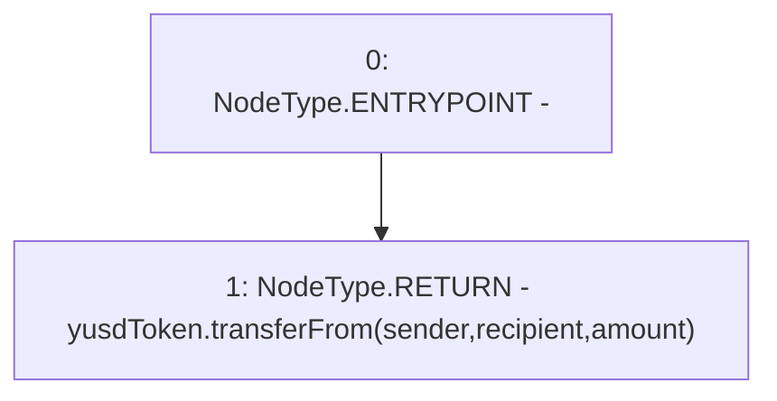

# Context: EchidnaProxy.transferFromPrx

**Contract:** `EchidnaProxy` (Inherits: None)
**Signature:** `transferFromPrx(address,address,uint256) returns (bool)`
**Method Selector ID:** `0xd94bcec2`
**Visibility:** `external`
**Environment-Free:** `Yes`
**Modifiers:** None

### State Variables Interaction
- **Reads:** yusdToken
- **Writes:** None

### Environment & Verification Flags
- **Uses Foundry Cheatcodes:** No
- **Has Echidna Properties:** No

### Internal Calls Tree
- None

### External Calls / Value Transfers
- `YUSDToken.TMP_2026(bool) = HIGH_LEVEL_CALL, dest:yusdToken(YUSDToken), function:transferFrom, arguments:['sender', 'recipient', 'amount']  `

### Control Flow Graph (CFG)


### Source Mapping
Declared in: `certora-ac-datasets/detasets/web3bugs/dataset/web3bugs/66/packages/contracts/contracts/TestContracts/EchidnaProxy.sol` on lines **138** to **140**

```solidity
    function transferFromPrx(address sender, address recipient, uint256 amount) external returns (bool) {
        return yusdToken.transferFrom(sender, recipient, amount);
    }

```
