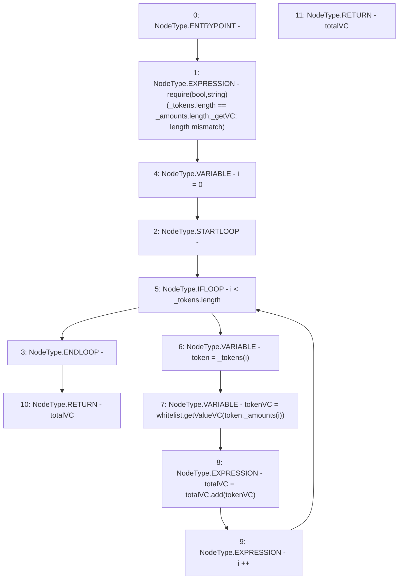

# Context: EchidnaTester._getVC

**Contract:** `EchidnaTester` (Inherits: None)
**Signature:** `_getVC(address[],uint256[]) returns (uint256)`
**Method Selector ID:** `Internal (No Method ID)`
**Visibility:** `internal`
**Environment-Free:** `Yes`
**Modifiers:** None

### State Variables Interaction
- **Reads:** whitelist
- **Writes:** None

### Assertion Checks & Business Requirements
- require/assert: `require(bool,string)(_tokens.length == _amounts.length,_getVC: length mismatch)`

### Environment & Verification Flags
- **Uses Foundry Cheatcodes:** No
- **Has Echidna Properties:** No

### Internal Calls Tree
- None

### External Calls / Value Transfers
- `SafeMath.TMP_2138(uint256) = LIBRARY_CALL, dest:SafeMath, function:SafeMath.add(uint256,uint256), arguments:['totalVC', 'tokenVC'] `
- `Whitelist.TMP_2137(uint256) = HIGH_LEVEL_CALL, dest:whitelist(Whitelist), function:getValueVC, arguments:['token', 'REF_2161']  `

### Control Flow Graph (CFG)


### Source Mapping
Declared in: `certora-ac-datasets/detasets/web3bugs/dataset/web3bugs/66/packages/contracts/contracts/TestContracts/EchidnaTester.sol` on lines **119** to **127**

```solidity
    function _getVC(address[] memory _tokens, uint[] memory _amounts) internal view returns (uint totalVC) {
        require(_tokens.length == _amounts.length, "_getVC: length mismatch");
        for (uint i = 0; i < _tokens.length; i++) {
            address token = _tokens[i];
            uint tokenVC = whitelist.getValueVC(token, _amounts[i]);
            totalVC = totalVC.add(tokenVC);
        }
        return totalVC;
    }

```
