# Context: EchidnaTester.constructor

**Contract:** `EchidnaTester` (Inherits: None)
**Signature:** `constructor()`
**Method Selector ID:** `0x90fa17bb`
**Visibility:** `public`
**Environment-Free:** `Yes`
**Modifiers:** None

### State Variables Interaction
- **Reads:** CCR, INITIAL_BALANCE, MCR, NUMBER_OF_ACTORS, activePool, borrowerOperations, collSurplusPool, defaultPool, echidnaProxies, gasPool, priceFeedTestnet, sortedTroves, stabilityPool, troveManager, troveManagerLiquidations, troveManagerRedemptions, whitelist, yusdToken
- **Writes:** CCR, MCR, YUSD_GAS_COMPENSATION, activePool, borrowerOperations, collSurplusPool, defaultPool, echidnaProxies, gasPool, priceFeedTestnet, sortedTroves, stabilityPool, troveManager, troveManagerLiquidations, troveManagerRedemptions, whitelist, yusdToken

### Assertion Checks & Business Requirements
- require/assert: `require(bool,string)(success,proxy called failed)`
- require/assert: `require(bool,string)(MCR != 0,MCR <= 0)`
- require/assert: `require(bool,string)(CCR != 0,CCR <= 0)`

### Environment & Verification Flags
- **Uses Foundry Cheatcodes:** No
- **Has Echidna Properties:** No

### Internal Calls Tree
- None

### External Calls / Value Transfers
- `DefaultPool.HIGH_LEVEL_CALL, dest:defaultPool(DefaultPool), function:setAddresses, arguments:['TMP_2096', 'TMP_2097', 'TMP_2098', 'TMP_2099']  `
- `CollSurplusPool.HIGH_LEVEL_CALL, dest:collSurplusPool(CollSurplusPool), function:setAddresses, arguments:['TMP_2110', 'TMP_2111', 'TMP_2112', 'TMP_2113', 'TMP_2114']  `
- `BorrowerOperations.HIGH_LEVEL_CALL, dest:borrowerOperations(BorrowerOperations), function:setAddresses, arguments:['TMP_2076', 'TMP_2077', 'TMP_2078', 'TMP_2079', 'TMP_2080', 'TMP_2081', 'TMP_2082', 'TMP_2083', 'TMP_2084', 'TMP_2085']  `
- `ActivePool.HIGH_LEVEL_CALL, dest:activePool(ActivePool), function:setAddresses, arguments:['TMP_2087', 'TMP_2088', 'TMP_2089', 'TMP_2090', 'TMP_2091', 'TMP_2092', 'TMP_2093', 'TMP_2094']  `
- `BorrowerOperations.TMP_2127(uint256) = HIGH_LEVEL_CALL, dest:borrowerOperations(BorrowerOperations), function:CCR, arguments:[]  `
- `low-level-call`
- `BorrowerOperations.TMP_2126(uint256) = HIGH_LEVEL_CALL, dest:borrowerOperations(BorrowerOperations), function:MCR, arguments:[]  `
- `TroveManager.HIGH_LEVEL_CALL, dest:troveManager(TroveManager), function:setAddresses, arguments:['TMP_2062', 'TMP_2063', 'TMP_2064', 'TMP_2065', 'TMP_2066', 'TMP_2067', 'TMP_2068', 'TMP_2069', 'TMP_2070', 'TMP_2071', 'TMP_2072', 'TMP_2073', 'TMP_2074']  `
- `BorrowerOperations.TMP_2128(uint256) = HIGH_LEVEL_CALL, dest:borrowerOperations(BorrowerOperations), function:YUSD_GAS_COMPENSATION, arguments:[]  `
- `PriceFeedTestnet.TMP_2133(bool) = HIGH_LEVEL_CALL, dest:priceFeedTestnet(PriceFeedTestnet), function:setPrice, arguments:['10000000000000000000000']  `
- `SortedTroves.HIGH_LEVEL_CALL, dest:sortedTroves(SortedTroves), function:setParams, arguments:['1000000000000000000', 'TMP_2116', 'TMP_2117', 'TMP_2118']  `
- `StabilityPool.HIGH_LEVEL_CALL, dest:stabilityPool(StabilityPool), function:setAddresses, arguments:['TMP_2101', 'TMP_2102', 'TMP_2103', 'TMP_2104', 'TMP_2105', 'TMP_2106', 'TMP_2107', 'TMP_2108']  `

### Control Flow Graph (CFG)

```mermaid
flowchart TD
    Node_0["0: NodeType.ENTRYPOINT - "]
    Node_0 --> Node_1
    Node_1["1: NodeType.EXPRESSION - troveManager = new TroveManager()"]
    Node_1 --> Node_2
    Node_2["2: NodeType.EXPRESSION - borrowerOperations = new BorrowerOperations()"]
    Node_2 --> Node_3
    Node_3["3: NodeType.EXPRESSION - activePool = new ActivePool()"]
    Node_3 --> Node_4
    Node_4["4: NodeType.EXPRESSION - defaultPool = new DefaultPool()"]
    Node_4 --> Node_5
    Node_5["5: NodeType.EXPRESSION - stabilityPool = new StabilityPool()"]
    Node_5 --> Node_6
    Node_6["6: NodeType.EXPRESSION - gasPool = new GasPool()"]
    Node_6 --> Node_7
    Node_7["7: NodeType.EXPRESSION - troveManagerLiquidations = new TroveManagerLiquidations()"]
    Node_7 --> Node_8
    Node_8["8: NodeType.EXPRESSION - troveManagerRedemptions = new TroveManagerRedemptions()"]
    Node_8 --> Node_9
    Node_9["9: NodeType.EXPRESSION - yusdToken = new YUSDToken(address(troveManager),address(troveManagerLiquidations),address(troveManagerRedemptions),address(stabilityPool),address(borrowerOperations))"]
    Node_9 --> Node_10
    Node_10["10: NodeType.EXPRESSION - whitelist = new Whitelist()"]
    Node_10 --> Node_11
    Node_11["11: NodeType.EXPRESSION - collSurplusPool = new CollSurplusPool()"]
    Node_11 --> Node_12
    Node_12["12: NodeType.EXPRESSION - priceFeedTestnet = new PriceFeedTestnet()"]
    Node_12 --> Node_13
    Node_13["13: NodeType.EXPRESSION - sortedTroves = new SortedTroves()"]
    Node_13 --> Node_14
    Node_14["14: NodeType.EXPRESSION - troveManager.setAddresses(address(borrowerOperations),address(activePool),address(defaultPool),address(stabilityPool),address(gasPool),address(collSurplusPool),address(priceFeedTestnet),address(yusdToken),address(sortedTroves),address(0),address(0),address(0),address(0))"]
    Node_14 --> Node_15
    Node_15["15: NodeType.EXPRESSION - borrowerOperations.setAddresses(address(troveManager),address(activePool),address(defaultPool),address(stabilityPool),address(gasPool),address(collSurplusPool),address(priceFeedTestnet),address(sortedTroves),address(yusdToken),address(0))"]
    Node_15 --> Node_16
    Node_16["16: NodeType.EXPRESSION - activePool.setAddresses(address(borrowerOperations),address(troveManager),address(stabilityPool),address(defaultPool),address(whitelist),address(troveManagerLiquidations),address(troveManagerRedemptions),address(collSurplusPool))"]
    Node_16 --> Node_17
    Node_17["17: NodeType.EXPRESSION - defaultPool.setAddresses(address(troveManager),address(activePool),address(whitelist),address(0))"]
    Node_17 --> Node_18
    Node_18["18: NodeType.EXPRESSION - stabilityPool.setAddresses(address(borrowerOperations),address(troveManager),address(activePool),address(yusdToken),address(sortedTroves),address(0),address(0),address(troveManagerLiquidations))"]
    Node_18 --> Node_19
    Node_19["19: NodeType.EXPRESSION - collSurplusPool.setAddresses(address(borrowerOperations),address(troveManager),address(troveManagerRedemptions),address(activePool),address(whitelist))"]
    Node_19 --> Node_20
    Node_20["20: NodeType.EXPRESSION - sortedTroves.setParams(1e18,address(troveManager),address(borrowerOperations),address(troveManagerRedemptions))"]
    Node_20 --> Node_23
    Node_21["21: NodeType.STARTLOOP - "]
    Node_21 --> Node_24
    Node_22["22: NodeType.ENDLOOP - "]
    Node_22 --> Node_30
    Node_23["23: NodeType.VARIABLE - i = 0"]
    Node_23 --> Node_21
    Node_24["24: NodeType.IFLOOP - i < NUMBER_OF_ACTORS"]
    Node_24 --> Node_25
    Node_24 --> Node_22
    Node_25["25: NodeType.EXPRESSION - echidnaProxies(i) = new EchidnaProxy(troveManager,borrowerOperations,stabilityPool,yusdToken)"]
    Node_25 --> Node_26
    Node_26["26: NodeType.VARIABLE - "]
    Node_26 --> Node_27
    Node_27["27: NodeType.EXPRESSION - (success,None) = address(echidnaProxies(i)).call(value: INITIAL_BALANCE)()"]
    Node_27 --> Node_28
    Node_28["28: NodeType.EXPRESSION - require(bool,string)(success,proxy called failed)"]
    Node_28 --> Node_29
    Node_29["29: NodeType.EXPRESSION - i ++"]
    Node_29 --> Node_24
    Node_30["30: NodeType.EXPRESSION - MCR = borrowerOperations.MCR()"]
    Node_30 --> Node_31
    Node_31["31: NodeType.EXPRESSION - CCR = borrowerOperations.CCR()"]
    Node_31 --> Node_32
    Node_32["32: NodeType.EXPRESSION - YUSD_GAS_COMPENSATION = borrowerOperations.YUSD_GAS_COMPENSATION()"]
    Node_32 --> Node_33
    Node_33["33: NodeType.EXPRESSION - require(bool,string)(MCR != 0,MCR <= 0)"]
    Node_33 --> Node_34
    Node_34["34: NodeType.EXPRESSION - require(bool,string)(CCR != 0,CCR <= 0)"]
    Node_34 --> Node_35
    Node_35["35: NodeType.EXPRESSION - priceFeedTestnet.setPrice(1e22)"]
```


### Source Mapping
Declared in: `certora-ac-datasets/detasets/web3bugs/dataset/web3bugs/66/packages/contracts/contracts/TestContracts/EchidnaTester.sol` on lines **52** to **116**

```solidity
    constructor() public payable {
        troveManager = new TroveManager();
        borrowerOperations = new BorrowerOperations();
        activePool = new ActivePool();
        defaultPool = new DefaultPool();
        stabilityPool = new StabilityPool();
        gasPool = new GasPool();
        troveManagerLiquidations = new TroveManagerLiquidations();
        troveManagerRedemptions = new TroveManagerRedemptions();
        yusdToken = new YUSDToken(
            address(troveManager),
            address(troveManagerLiquidations),
            address(troveManagerRedemptions),
            address(stabilityPool),
            address(borrowerOperations)
        );
        whitelist = new Whitelist();

        collSurplusPool = new CollSurplusPool();
        priceFeedTestnet = new PriceFeedTestnet();

        sortedTroves = new SortedTroves();

        troveManager.setAddresses(address(borrowerOperations), 
            address(activePool), address(defaultPool), 
            address(stabilityPool), address(gasPool), address(collSurplusPool),
            address(priceFeedTestnet), address(yusdToken), 
            address(sortedTroves), address(0), address(0), address(0), address(0));
       
        borrowerOperations.setAddresses(address(troveManager), 
            address(activePool), address(defaultPool), 
            address(stabilityPool), address(gasPool), address(collSurplusPool),
            address(priceFeedTestnet), address(sortedTroves), 
            address(yusdToken), address(0));

        activePool.setAddresses(address(borrowerOperations), 
            address(troveManager), address(stabilityPool), address(defaultPool), address(whitelist),
            address(troveManagerLiquidations), address(troveManagerRedemptions), address(collSurplusPool)
        );

        defaultPool.setAddresses(address(troveManager), address(activePool), address(whitelist), address(0));
        
        stabilityPool.setAddresses(address(borrowerOperations), 
            address(troveManager), address(activePool), address(yusdToken), 
            address(sortedTroves), address(0), address(0), address(troveManagerLiquidations)); 

        collSurplusPool.setAddresses(address(borrowerOperations), 
             address(troveManager), address(troveManagerRedemptions), address(activePool), address(whitelist));
    
        sortedTroves.setParams(1e18, address(troveManager), address(borrowerOperations), address(troveManagerRedemptions));

        for (uint i = 0; i < NUMBER_OF_ACTORS; i++) {
            echidnaProxies[i] = new EchidnaProxy(troveManager, borrowerOperations, stabilityPool, yusdToken);
            (bool success, ) = address(echidnaProxies[i]).call{value: INITIAL_BALANCE}("");
            require(success, "proxy called failed");
        }

        MCR = borrowerOperations.MCR();
        CCR = borrowerOperations.CCR();
        YUSD_GAS_COMPENSATION = borrowerOperations.YUSD_GAS_COMPENSATION();
        require(MCR != 0, "MCR <= 0");
        require(CCR != 0, "CCR <= 0");

        priceFeedTestnet.setPrice(1e22);
    }

```
