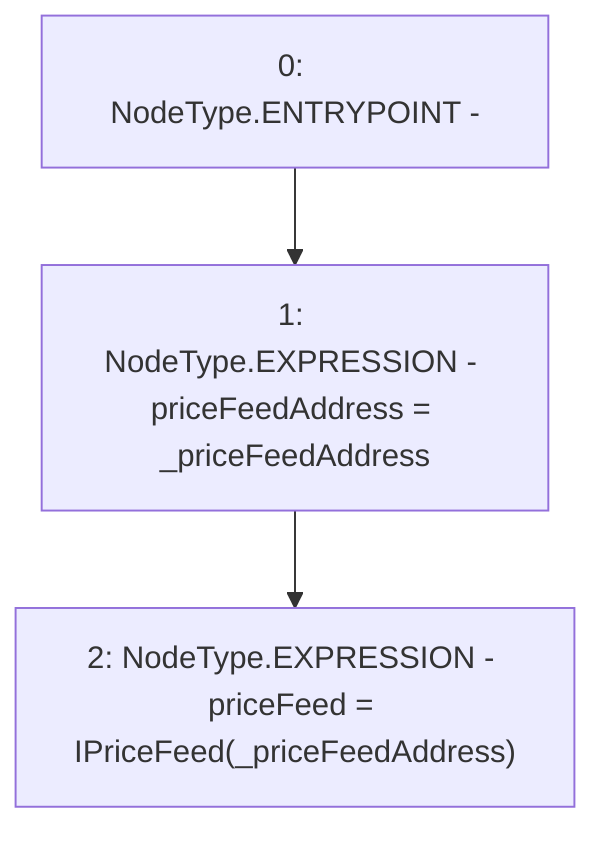

# Context: FunctionCaller.setPriceFeedAddress

**Contract:** `FunctionCaller` (Inherits: None)
**Signature:** `setPriceFeedAddress(address)`
**Method Selector ID:** `0x00cf5db4`
**Visibility:** `external`
**Environment-Free:** `Yes`
**Modifiers:** None

### State Variables Interaction
- **Reads:** None
- **Writes:** priceFeed, priceFeedAddress

### Environment & Verification Flags
- **Uses Foundry Cheatcodes:** No
- **Has Echidna Properties:** No

### Internal Calls Tree
- None

### External Calls / Value Transfers
- None

### Control Flow Graph (CFG)


### Source Mapping
Declared in: `certora-ac-datasets/detasets/web3bugs/dataset/web3bugs/66/packages/contracts/contracts/TestContracts/FunctionCaller.sol` on lines **35** to **38**

```solidity
    function setPriceFeedAddress(address _priceFeedAddress) external {
        priceFeedAddress = _priceFeedAddress;
        priceFeed = IPriceFeed(_priceFeedAddress);
    }

```
