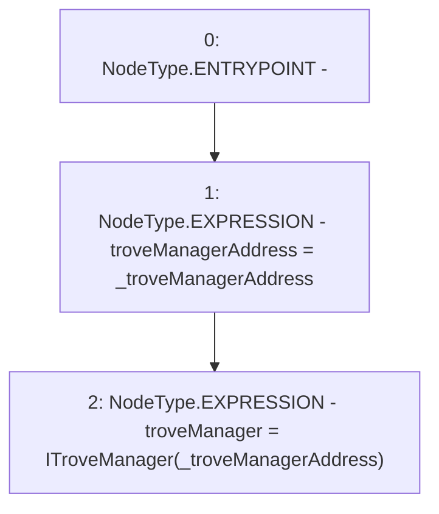

# Context: FunctionCaller.setTroveManagerAddress

**Contract:** `FunctionCaller` (Inherits: None)
**Signature:** `setTroveManagerAddress(address)`
**Method Selector ID:** `0xced2027c`
**Visibility:** `external`
**Environment-Free:** `Yes`
**Modifiers:** None

### State Variables Interaction
- **Reads:** None
- **Writes:** troveManager, troveManagerAddress

### Environment & Verification Flags
- **Uses Foundry Cheatcodes:** No
- **Has Echidna Properties:** No

### Internal Calls Tree
- None

### External Calls / Value Transfers
- None

### Control Flow Graph (CFG)


### Source Mapping
Declared in: `certora-ac-datasets/detasets/web3bugs/dataset/web3bugs/66/packages/contracts/contracts/TestContracts/FunctionCaller.sol` on lines **25** to **28**

```solidity
    function setTroveManagerAddress(address _troveManagerAddress) external {
        troveManagerAddress = _troveManagerAddress;
        troveManager = ITroveManager(_troveManagerAddress);
    }

```
