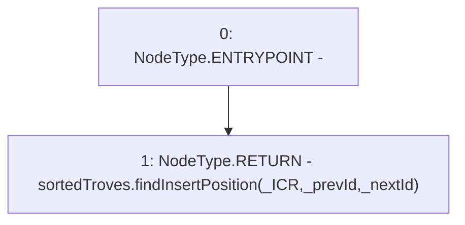

# Context: FunctionCaller.sortedTroves_findInsertPosition

**Contract:** `FunctionCaller` (Inherits: None)
**Signature:** `sortedTroves_findInsertPosition(uint256,address,address) returns (address, address)`
**Method Selector ID:** `0xdcc6710f`
**Visibility:** `external`
**Environment-Free:** `Yes`
**Modifiers:** None

### State Variables Interaction
- **Reads:** sortedTroves
- **Writes:** None

### Environment & Verification Flags
- **Uses Foundry Cheatcodes:** No
- **Has Echidna Properties:** No

### Internal Calls Tree
- None

### External Calls / Value Transfers
- `ISortedTroves.TUPLE_0(address,address) = HIGH_LEVEL_CALL, dest:sortedTroves(ISortedTroves), function:findInsertPosition, arguments:['_ICR', '_prevId', '_nextId']  `

### Control Flow Graph (CFG)


### Source Mapping
Declared in: `certora-ac-datasets/detasets/web3bugs/dataset/web3bugs/66/packages/contracts/contracts/TestContracts/FunctionCaller.sol` on lines **46** to **48**

```solidity
    function sortedTroves_findInsertPosition(uint _ICR, address _prevId, address _nextId) external view returns (address, address) {
        return sortedTroves.findInsertPosition(_ICR, _prevId, _nextId);
    }

```
