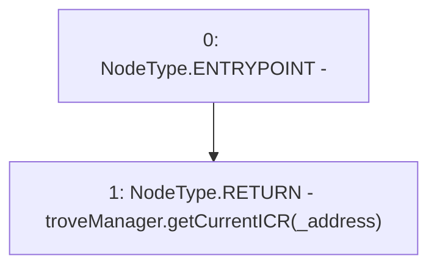

# Context: FunctionCaller.troveManager_getCurrentICR

**Contract:** `FunctionCaller` (Inherits: None)
**Signature:** `troveManager_getCurrentICR(address) returns (uint256)`
**Method Selector ID:** `0x753d3e5e`
**Visibility:** `external`
**Environment-Free:** `Yes`
**Modifiers:** None

### State Variables Interaction
- **Reads:** troveManager
- **Writes:** None

### Environment & Verification Flags
- **Uses Foundry Cheatcodes:** No
- **Has Echidna Properties:** No

### Internal Calls Tree
- None

### External Calls / Value Transfers
- `ITroveManager.TMP_48(uint256) = HIGH_LEVEL_CALL, dest:troveManager(ITroveManager), function:getCurrentICR, arguments:['_address']  `

### Control Flow Graph (CFG)


### Source Mapping
Declared in: `certora-ac-datasets/detasets/web3bugs/dataset/web3bugs/66/packages/contracts/contracts/TestContracts/FunctionCaller.sol` on lines **42** to **44**

```solidity
    function troveManager_getCurrentICR(address _address) external view returns (uint) {
        return troveManager.getCurrentICR(_address);
    }

```
