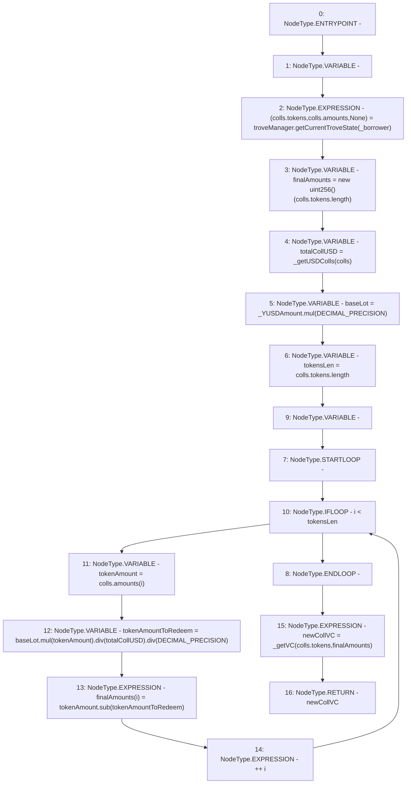

# Context: HintHelpers._calculateVCAfterRedemption

**Contract:** `HintHelpers` (Inherits: CheckContract, Ownable, LiquityBase, YetiCustomBase, BaseMath, ILiquityBase)
**Signature:** `_calculateVCAfterRedemption(address,uint256) returns (uint256)`
**Method Selector ID:** `Internal (No Method ID)`
**Visibility:** `internal`
**Environment-Free:** `Yes`
**Modifiers:** None

### State Variables Interaction
- **Reads:** DECIMAL_PRECISION, troveManager
- **Writes:** None

### Environment & Verification Flags
- **Uses Foundry Cheatcodes:** No
- **Has Echidna Properties:** No

### Internal Calls Tree
- None

### External Calls / Value Transfers
- `SafeMath.TMP_362(uint256) = LIBRARY_CALL, dest:SafeMath, function:SafeMath.mul(uint256,uint256), arguments:['_YUSDAmount', 'DECIMAL_PRECISION'] `
- `SafeMath.TMP_367(uint256) = LIBRARY_CALL, dest:SafeMath, function:SafeMath.sub(uint256,uint256), arguments:['tokenAmount', 'tokenAmountToRedeem'] `
- `SafeMath.TMP_366(uint256) = LIBRARY_CALL, dest:SafeMath, function:SafeMath.div(uint256,uint256), arguments:['TMP_365', 'DECIMAL_PRECISION'] `
- `SafeMath.TMP_365(uint256) = LIBRARY_CALL, dest:SafeMath, function:SafeMath.div(uint256,uint256), arguments:['TMP_364', 'totalCollUSD'] `
- `ITroveManager.TUPLE_0(address[],uint256[],uint256) = HIGH_LEVEL_CALL, dest:troveManager(ITroveManager), function:getCurrentTroveState, arguments:['_borrower']  `
- `SafeMath.TMP_364(uint256) = LIBRARY_CALL, dest:SafeMath, function:SafeMath.mul(uint256,uint256), arguments:['baseLot', 'tokenAmount'] `

### Control Flow Graph (CFG)


### Source Mapping
Declared in: `certora-ac-datasets/detasets/web3bugs/dataset/web3bugs/66/packages/contracts/contracts/HintHelpers.sol` on lines **129** to **147**

```solidity
    function _calculateVCAfterRedemption(address _borrower, uint _YUSDAmount) internal view returns (uint newCollVC) {
        newColls memory colls;
        (colls.tokens, colls.amounts, ) = troveManager.getCurrentTroveState(_borrower);

        uint256[] memory finalAmounts = new uint256[](colls.tokens.length);

        uint totalCollUSD = _getUSDColls(colls);
        uint baseLot = _YUSDAmount.mul(DECIMAL_PRECISION);

        // redemption addresses are the same as coll addresses for trove
        uint256 tokensLen = colls.tokens.length;
        for (uint256 i; i < tokensLen; ++i) {
            uint tokenAmount = colls.amounts[i];
            uint tokenAmountToRedeem = baseLot.mul(tokenAmount).div(totalCollUSD).div(DECIMAL_PRECISION);
            finalAmounts[i] = tokenAmount.sub(tokenAmountToRedeem);
        }

        newCollVC = _getVC(colls.tokens, finalAmounts);
    }

```
