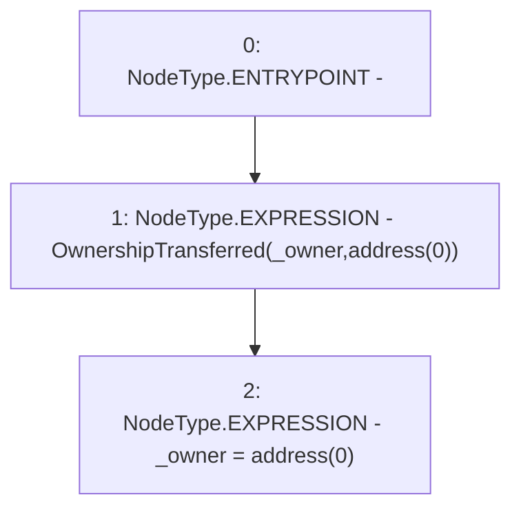

# Context: HintHelpers._renounceOwnership

**Contract:** `HintHelpers` (Inherits: CheckContract, Ownable, LiquityBase, YetiCustomBase, BaseMath, ILiquityBase)
**Signature:** `_renounceOwnership()`
**Method Selector ID:** `Internal (No Method ID)`
**Visibility:** `internal`
**Environment-Free:** `Yes`
**Modifiers:** None

### State Variables Interaction
- **Reads:** _owner
- **Writes:** _owner

### Environment & Verification Flags
- **Uses Foundry Cheatcodes:** No
- **Has Echidna Properties:** No

### Internal Calls Tree
- None

### External Calls / Value Transfers
- None

### Control Flow Graph (CFG)


### Source Mapping
Declared in: `certora-ac-datasets/detasets/web3bugs/dataset/web3bugs/66/packages/contracts/contracts/Dependencies/Ownable.sol` on lines **62** to **65**

```solidity
    function _renounceOwnership() internal {
        emit OwnershipTransferred(_owner, address(0));
        _owner = address(0);
    }

```
