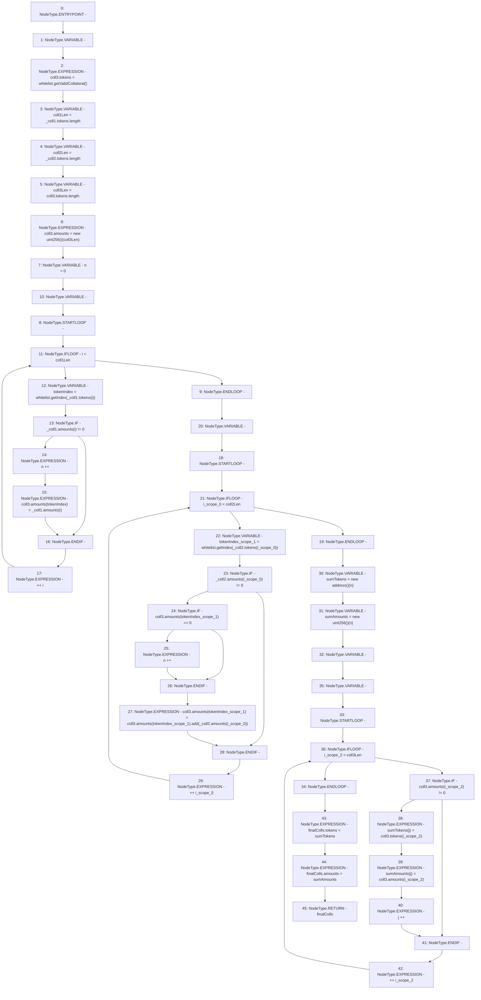

# Context: HintHelpers._sumColls

**Contract:** `HintHelpers` (Inherits: CheckContract, Ownable, LiquityBase, YetiCustomBase, BaseMath, ILiquityBase)
**Signature:** `_sumColls(YetiCustomBase.newColls,YetiCustomBase.newColls) returns (YetiCustomBase.newColls)`
**Method Selector ID:** `Internal (No Method ID)`
**Visibility:** `internal`
**Environment-Free:** `Yes`
**Modifiers:** None

### State Variables Interaction
- **Reads:** whitelist
- **Writes:** None

### Environment & Verification Flags
- **Uses Foundry Cheatcodes:** No
- **Has Echidna Properties:** No

### Internal Calls Tree
- None

### External Calls / Value Transfers
- `IWhitelist.TMP_261(uint256) = HIGH_LEVEL_CALL, dest:whitelist(IWhitelist), function:getIndex, arguments:['REF_303']  `
- `SafeMath.TMP_269(uint256) = LIBRARY_CALL, dest:SafeMath, function:SafeMath.add(uint256,uint256), arguments:['REF_320', 'REF_323'] `
- `IWhitelist.TMP_265(uint256) = HIGH_LEVEL_CALL, dest:whitelist(IWhitelist), function:getIndex, arguments:['REF_312']  `
- `IWhitelist.TMP_257(address[]) = HIGH_LEVEL_CALL, dest:whitelist(IWhitelist), function:getValidCollateral, arguments:[]  `

### Control Flow Graph (CFG)


### Source Mapping
Declared in: `certora-ac-datasets/detasets/web3bugs/dataset/web3bugs/66/packages/contracts/contracts/Dependencies/YetiCustomBase.sol` on lines **25** to **71**

```solidity
    function _sumColls(newColls memory _coll1, newColls memory _coll2)
        internal
        view
        returns (newColls memory finalColls)
    {
        newColls memory coll3;

        coll3.tokens = whitelist.getValidCollateral();
        uint256 coll1Len = _coll1.tokens.length;
        uint256 coll2Len = _coll2.tokens.length;
        uint256 coll3Len = coll3.tokens.length;
        coll3.amounts = new uint256[](coll3Len);

        uint256 n = 0;
        for (uint256 i; i < coll1Len; ++i) {
            uint256 tokenIndex = whitelist.getIndex(_coll1.tokens[i]);
            if (_coll1.amounts[i] != 0) {
                n++;
                coll3.amounts[tokenIndex] = _coll1.amounts[i];
            }
        }

        for (uint256 i; i < coll2Len; ++i) {
            uint256 tokenIndex = whitelist.getIndex(_coll2.tokens[i]);
            if (_coll2.amounts[i] != 0) {
                if (coll3.amounts[tokenIndex] == 0) {
                    n++;
                }
                coll3.amounts[tokenIndex] = coll3.amounts[tokenIndex].add(_coll2.amounts[i]);
            }
        }

        address[] memory sumTokens = new address[](n);
        uint256[] memory sumAmounts = new uint256[](n);
        uint256 j;

        // should only find n amounts over 0
        for (uint256 i; i < coll3Len; ++i) {
            if (coll3.amounts[i] != 0) {
                sumTokens[j] = coll3.tokens[i];
                sumAmounts[j] = coll3.amounts[i];
                j++;
            }
        }
        finalColls.tokens = sumTokens;
        finalColls.amounts = sumAmounts;
    }

```
