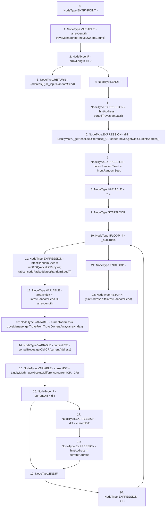

# Context: HintHelpers.getApproxHint

**Contract:** `HintHelpers` (Inherits: CheckContract, Ownable, LiquityBase, YetiCustomBase, BaseMath, ILiquityBase)
**Signature:** `getApproxHint(uint256,uint256,uint256) returns (address, uint256, uint256)`
**Method Selector ID:** `0x7b41bdbe`
**Visibility:** `external`
**Environment-Free:** `Yes`
**Modifiers:** None

### State Variables Interaction
- **Reads:** sortedTroves, troveManager
- **Writes:** None

### Environment & Verification Flags
- **Uses Foundry Cheatcodes:** No
- **Has Echidna Properties:** No

### Internal Calls Tree
- None

### External Calls / Value Transfers
- `ITroveManager.TMP_369(uint256) = HIGH_LEVEL_CALL, dest:troveManager(ITroveManager), function:getTroveOwnersCount, arguments:[]  `
- `ISortedTroves.TMP_372(address) = HIGH_LEVEL_CALL, dest:sortedTroves(ISortedTroves), function:getLast, arguments:[]  `
- `ITroveManager.TMP_380(address) = HIGH_LEVEL_CALL, dest:troveManager(ITroveManager), function:getTroveFromTroveOwnersArray, arguments:['arrayIndex']  `
- `ISortedTroves.TMP_381(uint256) = HIGH_LEVEL_CALL, dest:sortedTroves(ISortedTroves), function:getOldICR, arguments:['currentAddress']  `
- `LiquityMath.TMP_382(uint256) = LIBRARY_CALL, dest:LiquityMath, function:LiquityMath._getAbsoluteDifference(uint256,uint256), arguments:['currentICR', '_CR'] `
- `LiquityMath.TMP_374(uint256) = LIBRARY_CALL, dest:LiquityMath, function:LiquityMath._getAbsoluteDifference(uint256,uint256), arguments:['_CR', 'TMP_373'] `
- `ISortedTroves.TMP_373(uint256) = HIGH_LEVEL_CALL, dest:sortedTroves(ISortedTroves), function:getOldICR, arguments:['hintAddress']  `

### Control Flow Graph (CFG)


### Source Mapping
Declared in: `certora-ac-datasets/detasets/web3bugs/dataset/web3bugs/66/packages/contracts/contracts/HintHelpers.sol` on lines **159** to **192**

```solidity
    function getApproxHint(uint _CR, uint _numTrials, uint _inputRandomSeed)
        external
        view
        returns (address hintAddress, uint diff, uint latestRandomSeed)
    {
        uint arrayLength = troveManager.getTroveOwnersCount();

        if (arrayLength == 0) {
            return (address(0), 0, _inputRandomSeed);
        }

        hintAddress = sortedTroves.getLast();
        diff = LiquityMath._getAbsoluteDifference(_CR, sortedTroves.getOldICR(hintAddress));
        latestRandomSeed = _inputRandomSeed;

        uint i = 1;

        while (i < _numTrials) {
            latestRandomSeed = uint(keccak256(abi.encodePacked(latestRandomSeed)));

            uint arrayIndex = latestRandomSeed % arrayLength;
            address currentAddress = troveManager.getTroveFromTroveOwnersArray(arrayIndex);
            uint currentICR = sortedTroves.getOldICR(currentAddress);

            // check if abs(current - CR) > abs(closest - CR), and update closest if current is closer
            uint currentDiff = LiquityMath._getAbsoluteDifference(currentICR, _CR);

            if (currentDiff < diff) {
                diff = currentDiff;
                hintAddress = currentAddress;
            }
            ++i;
        }
    }

```
