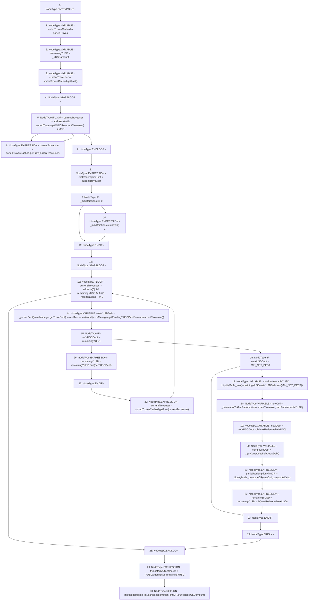

# Context: HintHelpers.getRedemptionHints

**Contract:** `HintHelpers` (Inherits: CheckContract, Ownable, LiquityBase, YetiCustomBase, BaseMath, ILiquityBase)
**Signature:** `getRedemptionHints(uint256,uint256) returns (address, uint256, uint256)`
**Method Selector ID:** `0x8ac54b0d`
**Visibility:** `external`
**Environment-Free:** `Yes`
**Modifiers:** None

### State Variables Interaction
- **Reads:** MCR, MIN_NET_DEBT, sortedTroves, troveManager
- **Writes:** None

### Environment & Verification Flags
- **Uses Foundry Cheatcodes:** No
- **Has Echidna Properties:** No

### Internal Calls Tree
- None

### External Calls / Value Transfers
- `ITroveManager.TMP_345(uint256) = HIGH_LEVEL_CALL, dest:troveManager(ITroveManager), function:getPendingYUSDDebtReward, arguments:['currentTroveuser']  `
- `ITroveManager.TMP_343(uint256) = HIGH_LEVEL_CALL, dest:troveManager(ITroveManager), function:getTroveDebt, arguments:['currentTroveuser']  `
- `ISortedTroves.TMP_332(address) = HIGH_LEVEL_CALL, dest:sortedTrovesCached(ISortedTroves), function:getPrev, arguments:['currentTroveuser']  `
- `ISortedTroves.TMP_329(uint256) = HIGH_LEVEL_CALL, dest:sortedTroves(ISortedTroves), function:getOldICR, arguments:['currentTroveuser']  `
- `SafeMath.TMP_352(uint256) = LIBRARY_CALL, dest:SafeMath, function:SafeMath.sub(uint256,uint256), arguments:['netYUSDDebt', 'maxRedeemableYUSD'] `
- `SafeMath.TMP_349(uint256) = LIBRARY_CALL, dest:SafeMath, function:SafeMath.sub(uint256,uint256), arguments:['netYUSDDebt', 'MIN_NET_DEBT'] `
- `SafeMath.TMP_358(uint256) = LIBRARY_CALL, dest:SafeMath, function:SafeMath.sub(uint256,uint256), arguments:['_YUSDamount', 'remainingYUSD'] `
- `SafeMath.TMP_355(uint256) = LIBRARY_CALL, dest:SafeMath, function:SafeMath.sub(uint256,uint256), arguments:['remainingYUSD', 'maxRedeemableYUSD'] `
- `SafeMath.TMP_346(uint256) = LIBRARY_CALL, dest:SafeMath, function:SafeMath.add(uint256,uint256), arguments:['TMP_344', 'TMP_345'] `
- `LiquityMath.TMP_354(uint256) = LIBRARY_CALL, dest:LiquityMath, function:LiquityMath._computeCR(uint256,uint256), arguments:['newColl', 'compositeDebt'] `
- `LiquityMath.TMP_350(uint256) = LIBRARY_CALL, dest:LiquityMath, function:LiquityMath._min(uint256,uint256), arguments:['remainingYUSD', 'TMP_349'] `
- `ISortedTroves.TMP_357(address) = HIGH_LEVEL_CALL, dest:sortedTrovesCached(ISortedTroves), function:getPrev, arguments:['currentTroveuser']  `
- `SafeMath.TMP_356(uint256) = LIBRARY_CALL, dest:SafeMath, function:SafeMath.sub(uint256,uint256), arguments:['remainingYUSD', 'netYUSDDebt'] `
- `ISortedTroves.TMP_326(address) = HIGH_LEVEL_CALL, dest:sortedTrovesCached(ISortedTroves), function:getLast, arguments:[]  `

### Control Flow Graph (CFG)


### Source Mapping
Declared in: `certora-ac-datasets/detasets/web3bugs/dataset/web3bugs/66/packages/contracts/contracts/HintHelpers.sol` on lines **73** to **125**

```solidity
    function getRedemptionHints(
        uint _YUSDamount, 
        uint _maxIterations
    )
        external
        view
        returns (
            address firstRedemptionHint,
            uint partialRedemptionHintICR,
            uint truncatedYUSDamount
        )
    {
        ISortedTroves sortedTrovesCached = sortedTroves;

        uint remainingYUSD = _YUSDamount;
        address currentTroveuser = sortedTrovesCached.getLast();

        while (currentTroveuser != address(0) && sortedTroves.getOldICR(currentTroveuser) < MCR) {
            currentTroveuser = sortedTrovesCached.getPrev(currentTroveuser);
        }

        firstRedemptionHint = currentTroveuser;

        if (_maxIterations == 0) {
            _maxIterations = uint(-1);
        }

        while (currentTroveuser != address(0) && remainingYUSD != 0 && _maxIterations-- != 0) {
            uint netYUSDDebt = _getNetDebt(troveManager.getTroveDebt(currentTroveuser))
                .add(troveManager.getPendingYUSDDebtReward(currentTroveuser));

            if (netYUSDDebt > remainingYUSD) { // Partial redemption
                if (netYUSDDebt > MIN_NET_DEBT) { // MIN NET DEBT = 1800
                    uint maxRedeemableYUSD = LiquityMath._min(remainingYUSD, netYUSDDebt.sub(MIN_NET_DEBT));

                    uint newColl = _calculateVCAfterRedemption(currentTroveuser, maxRedeemableYUSD);
                    uint newDebt = netYUSDDebt.sub(maxRedeemableYUSD);

                    uint compositeDebt = _getCompositeDebt(newDebt);
                    partialRedemptionHintICR = LiquityMath._computeCR(newColl, compositeDebt);

                    remainingYUSD = remainingYUSD.sub(maxRedeemableYUSD);
                }
                break;
            } else { // Full redemption in this case
                remainingYUSD = remainingYUSD.sub(netYUSDDebt);
            }

            currentTroveuser = sortedTrovesCached.getPrev(currentTroveuser);
        }

        truncatedYUSDamount = _YUSDamount.sub(remainingYUSD);
    }

```
