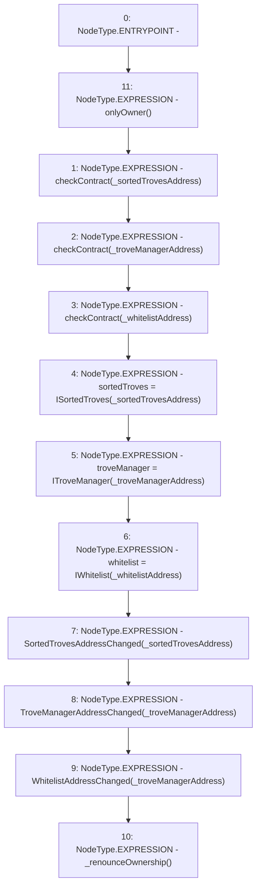

# Context: HintHelpers.setAddresses

**Contract:** `HintHelpers` (Inherits: CheckContract, Ownable, LiquityBase, YetiCustomBase, BaseMath, ILiquityBase)
**Signature:** `setAddresses(address,address,address)`
**Method Selector ID:** `0x363bf964`
**Visibility:** `external`
**Environment-Free:** `No (reads EVM state context)`
**Modifiers:**
- `onlyOwner`
  ```solidity
  modifier onlyOwner() {
          require(isOwner(), "CallerNotOwner");
          _;
      }
  ```

### State Variables Interaction
- **Reads:** None
- **Writes:** sortedTroves, troveManager, whitelist

### Environment & Verification Flags
- **Uses Foundry Cheatcodes:** No
- **Has Echidna Properties:** No

### Internal Calls Tree
- None

### External Calls / Value Transfers
- None

### Control Flow Graph (CFG)


### Source Mapping
Declared in: `certora-ac-datasets/detasets/web3bugs/dataset/web3bugs/66/packages/contracts/contracts/HintHelpers.sol` on lines **31** to **52**

```solidity
    function setAddresses(
        address _sortedTrovesAddress,
        address _troveManagerAddress,
        address _whitelistAddress
    )
        external
        onlyOwner
    {
        checkContract(_sortedTrovesAddress);
        checkContract(_troveManagerAddress);
        checkContract(_whitelistAddress);

        sortedTroves = ISortedTroves(_sortedTrovesAddress);
        troveManager = ITroveManager(_troveManagerAddress);
        whitelist = IWhitelist(_whitelistAddress);

        emit SortedTrovesAddressChanged(_sortedTrovesAddress);
        emit TroveManagerAddressChanged(_troveManagerAddress);
        emit WhitelistAddressChanged(_troveManagerAddress);

        _renounceOwnership();
    }

```
