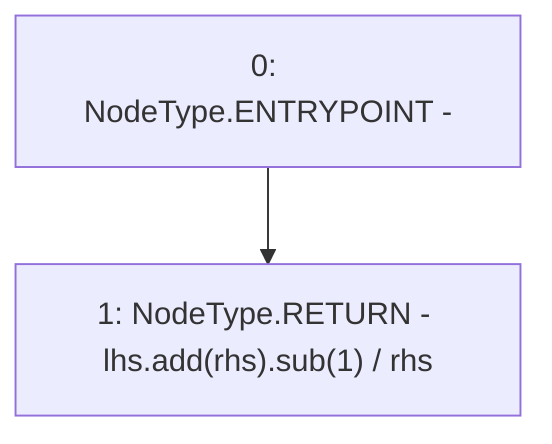

# Context: HomoraMath.divCeil

**Contract:** `HomoraMath` (Inherits: None)
**Signature:** `divCeil(uint256,uint256) returns (uint256)`
**Method Selector ID:** `Internal (No Method ID)`
**Visibility:** `internal`
**Environment-Free:** `Yes`
**Modifiers:** None

### State Variables Interaction
- **Reads:** None
- **Writes:** None

### Environment & Verification Flags
- **Uses Foundry Cheatcodes:** No
- **Has Echidna Properties:** No

### Internal Calls Tree
- None

### External Calls / Value Transfers
- `SafeMath.TMP_0(uint256) = LIBRARY_CALL, dest:SafeMath, function:SafeMath.add(uint256,uint256), arguments:['lhs', 'rhs'] `
- `SafeMath.TMP_1(uint256) = LIBRARY_CALL, dest:SafeMath, function:SafeMath.sub(uint256,uint256), arguments:['TMP_0', '1'] `

### Control Flow Graph (CFG)


### Source Mapping
Declared in: `certora-ac-datasets/detasets/web3bugs/dataset/web3bugs/66/packages/contracts/contracts/Dependencies/HomoraMath.sol` on lines **10** to **12**

```solidity
  function divCeil(uint lhs, uint rhs) internal pure returns (uint) {
    return lhs.add(rhs).sub(1) / rhs;
  }

```
