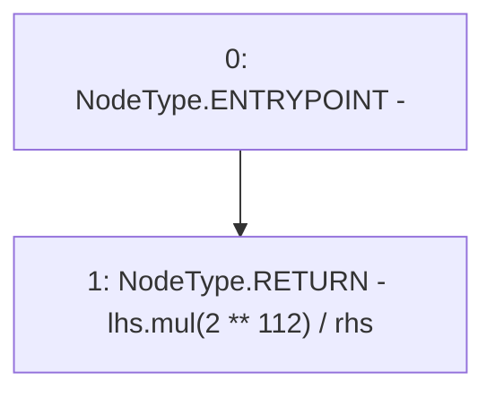

# Context: HomoraMath.fdiv

**Contract:** `HomoraMath` (Inherits: None)
**Signature:** `fdiv(uint256,uint256) returns (uint256)`
**Method Selector ID:** `Internal (No Method ID)`
**Visibility:** `internal`
**Environment-Free:** `Yes`
**Modifiers:** None

### State Variables Interaction
- **Reads:** None
- **Writes:** None

### Environment & Verification Flags
- **Uses Foundry Cheatcodes:** No
- **Has Echidna Properties:** No

### Internal Calls Tree
- None

### External Calls / Value Transfers
- `SafeMath.TMP_7(uint256) = LIBRARY_CALL, dest:SafeMath, function:SafeMath.mul(uint256,uint256), arguments:['lhs', 'TMP_6'] `

### Control Flow Graph (CFG)


### Source Mapping
Declared in: `certora-ac-datasets/detasets/web3bugs/dataset/web3bugs/66/packages/contracts/contracts/Dependencies/HomoraMath.sol` on lines **18** to **20**

```solidity
  function fdiv(uint lhs, uint rhs) internal pure returns (uint) {
    return lhs.mul(2**112) / rhs;
  }

```
