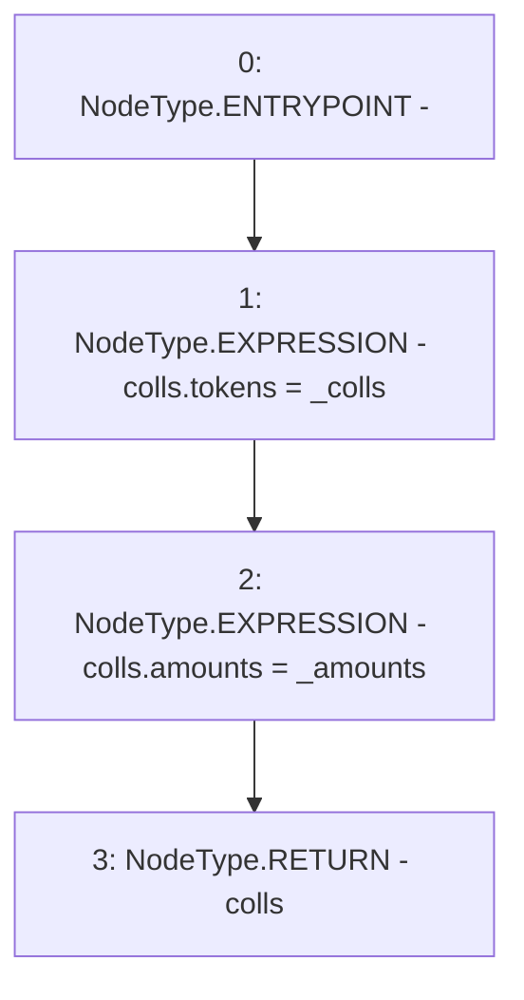

# Context: LiquityBaseTester._toColls

**Contract:** `LiquityBaseTester` (Inherits: LiquityBase, YetiCustomBase, BaseMath, ILiquityBase)
**Signature:** `_toColls(address[],uint256[]) returns (YetiCustomBase.newColls)`
**Method Selector ID:** `Internal (No Method ID)`
**Visibility:** `internal`
**Environment-Free:** `Yes`
**Modifiers:** None

### State Variables Interaction
- **Reads:** None
- **Writes:** None

### Environment & Verification Flags
- **Uses Foundry Cheatcodes:** No
- **Has Echidna Properties:** No

### Internal Calls Tree
- None

### External Calls / Value Transfers
- None

### Control Flow Graph (CFG)


### Source Mapping
Declared in: `certora-ac-datasets/detasets/web3bugs/dataset/web3bugs/66/packages/contracts/contracts/TestContracts/LiquityBaseTester.sol` on lines **19** to **22**

```solidity
    function _toColls(address[] memory _colls, uint[] memory _amounts) internal pure returns (newColls memory colls) {
        colls.tokens = _colls;
        colls.amounts = _amounts;
    }

```
